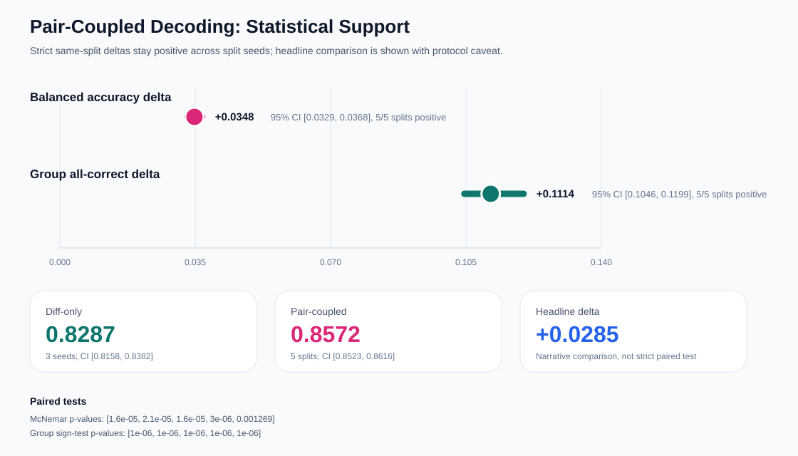

# VeriSec Forge: Application One-Pager

## One-Sentence Summary

VeriSec Forge is a shortcut-aware secure patch/diff reasoning system that diagnoses misleading vulnerability-detection scores, replaces standalone snippet classification with paired vulnerable/fixed diff reasoning, and makes the resulting audit loop reproducible through public bundle-assisted artifacts.

## Research Motivation

Standard vulnerability-detection benchmarks can reward dataset shortcuts such as project identity, code length, CVE leakage, or split artifacts. VeriSec Forge asks a stricter question: can a model reason over paired vulnerable/fixed code changes, make consistent side decisions, and expose when evidence localization or correction gates fail?

## Three Contributions

1. Shortcut-aware benchmark diagnosis.
   A same-source PrimeVul detector reaches `0.9524` accuracy, but paired stress testing shows that score is artifact-sensitive rather than a robust semantic vulnerability-detection breakthrough. Negative controls stay near chance, the current disjoint stress matrix removes eval rows overlapping training by project/CVE/commit/file hash, and a true CVE-year time split is now materialized.

2. Paired diff reasoning plus pair-coupled decoding.
   Diff-only paired evaluation reaches `0.8158` balanced accuracy, three-seed mean `0.8287`, and no-metadata `0.8244`. Pair-coupled decoding over five pair-key split seeds improves mean balanced accuracy to `0.8572`; the strict same-split pair-minus-bucket BA delta is `+0.0348` with bootstrap 95% CI `[0.0329, 0.0368]`.

   The result now has external stress coverage rather than only PrimeVul-internal validation: project-disjoint BA `0.8225`, later-CVE time-disjoint direct-train BA `0.8835`, DeltaSecommits pair-coupled BA `0.8563`, and PatchEval adapter three-seed mean BA `0.8172`. A three-source source-routed adapter mixture improves aggregate BA from `0.8591` to `0.8664`. The learned diff-body-only router reaches `0.9063` row routing accuracy and end-to-end routed BA `0.8664`, but the claim is explicitly bounded as closed-world source-aware expert selection: BA gain over single is `+0.0073` with CI `[0.0000, 0.0145]`, group all-correct is not reliable, and leave-one-source stress prevents open-set overclaiming.

3. Evidence-coupled audit loop.
   Hunk/window localization shows that evidence quality is strongly coupled to upstream side correctness: side-correct rows reach top-1 `0.7610`, while side-wrong rows fall to `0.0632`. The current audit loop includes AI-filled adjudication for `20` routed rows, precision-first safe-flip gates, a public reproduction bundle, and an artifact-backed patch review demo.

## Current Evidence

- Tests: see the latest CI/local pytest run in the repository history.
- PrimeVul public bundle SHA256: `6cac8dc70f9113ee9a65c4b64ae40e99dd9bc1cf786ba348ad7e8a09f0432466`.
- PrimeVul public bundle URL: `https://github.com/cyb2oo2/verisec-forge/releases/download/primevul-repro-bundle-v1/verisec_forge_primevul_repro_bundle.zip`.
- External-generalization public bundle SHA256: `fc34a8f5d94a602289bf481dfaf053fcd0cef4730190cda8cc63542a9ce01a25`.
- External-generalization public bundle URL: `https://github.com/cyb2oo2/verisec-forge/releases/download/external-generalization-bundle-v7/verisec_forge_external_generalization_bundle_v7.zip`.
- Main project story: `PROJECT_STORY.md`.
- Progressive controls: `reports/PRIMEVUL_PROGRESSIVE_CONTROLS.md`.
- Pair-coupled multi-split report: `reports/PRIMEVUL_PAIR_COUPLED_MULTISPLIT_BALANCED.md`.
- Pair-coupled significance summary: `reports/PRIMEVUL_PAIR_COUPLED_SIGNIFICANCE.md`.
- Disjoint stress evaluation: `reports/PRIMEVUL_DISJOINT_STRESS_EVAL.md`.
- Time-disjoint split manifest: `reports/PRIMEVUL_TIME_DISJOINT_PAIR_DIFF_SPLIT.md`.
- Time-disjoint transfer result: `reports/PRIMEVUL_TIME_DISJOINT_TRANSFER.md`.
- Time-disjoint direct-train result: `reports/PRIMEVUL_TIME_DISJOINT_DIRECT_TRAIN.md`.
- Time-disjoint comparison: `reports/PRIMEVUL_TIME_DISJOINT_COMPARISON.md`.
- Time-disjoint composite stress: `reports/PRIMEVUL_TIME_DISJOINT_COMPOSITE_STRESS.md`.
- DeltaSecommits pair-diff dataset: `reports/DELTASECCOMMITS_PAIR_DIFF_DATASET.md`.
- DeltaSecommits zero-shot transfer: `reports/DELTASECCOMMITS_ZERO_SHOT_PRIMEVUL_TIME_CHECKPOINT.md`.
- DeltaSecommits cross-source ablation: `reports/DELTASECCOMMITS_CROSS_SOURCE_ABLATION.md`.
- CVE-disjoint stress evaluation: `reports/PRIMEVUL_CVE_DISJOINT_EVAL.md`.
- AI adjudication summary: `reports/PRIMEVUL_AI_ADJUDICATION_SUMMARY.md`.
- Patch review demo: `docs/PATCH_REVIEW_DEMO.md`.
- Learned router claim boundary: `reports/LEARNED_ROUTER_CLAIM_BOUNDARY.md`.
- Reproducibility guide: `REPRODUCIBILITY.md`.

## Honest Limitations

- Evidence localization still uses pseudo labels, pilot triage, and AI-filled adjudication; final evidence labels require non-AI independent adjudication.
- Safe flip gate pools remain small and should be expanded beyond top-5/top-10 candidates.
- Project/CVE/commit/file-hash disjoint stress evaluation is covered, the true time-disjoint setting now has zero-retraining transfer, direct `<=2020` training, and a project/file-hash composite stress slice. DeltaSecommits and PatchEval now provide second- and third-source validation. Cross-source threshold calibration is not the missing lever; source-routed experts help, leave-one-source stress bounds the router as closed-world, and feature ablation shows the routed-system signal survives weaker token/diff-line views. The next check is multi-seed routing stability and richer source-specialization tradeoff analysis.
- The public bundles cover the manifest-backed PrimeVul router/evidence-coupled and external-generalization/source-routing chains. The repo still does not archive every exploratory run, raw upstream dataset, or model checkpoint.

## Next Research Steps

1. Add multi-seed routing stability and a clearer source-specialization tradeoff analysis for the three-source router.
2. Expand AI-filled evidence adjudication and side-inversion review queues to larger stratified samples while keeping them separate from human gold.
3. Add a small non-AI evidence adjudication pass for the highest-value disagreement and insufficient-context queues.
4. Turn the artifact-backed patch-review demo into a richer external-validation walkthrough over the public bundles.

## Recommended Framing

The project should be framed as shortcut-aware paired diff reasoning plus a reproducible evidence-coupled audit loop. The strongest claim is not that a single model solves vulnerability detection, but that stricter paired evaluation, negative controls, pair-coupled decoding, and explicit failure repair protocols make secure-code reasoning more trustworthy and explainable.
