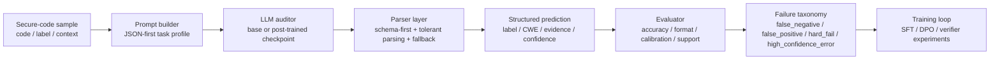

# VeriSec Forge

**Verifiable post-training and auto-benchmarking for structured secure-code reasoning.**

VeriSec Forge is a research-first codebase for studying whether open-weight LLMs can make **trustworthy, structured security judgments about code**. The project focuses on **defensive analysis**, not exploit generation: given a code snippet, the model must decide whether a vulnerability is present, assign a structured weakness label, justify the decision, and stay inside a machine-checkable output contract.

This repository is built to answer a practical research question:

> Can we improve secure-code reasoning with structured post-training while separating true semantic failure from parser noise, explanation drift, and calibration mistakes?

## Why This Repo Exists

Most secure-code LLM demos blur together several different failure modes:

- the model judged the code incorrectly
- the model used the right label but the wrong rationale
- the output format broke, so the benchmark undercounted it
- the model was confidently wrong
- a second-pass verifier improved recall, but only by becoming noisy

VeriSec Forge is designed to **untangle those cases**. It combines:

- structured secure-code tasks
- JSON-first prompting and parser-aware recovery
- automated evaluation
- failure taxonomy
- SFT / DPO / verifier experiments
- reproducible reports and diagnostics

## Current Headline Results

Primary benchmark:

- `PrimeVul eval244`
- balanced split: `122 vulnerable + 122 safe`

Harder generalization check:

- `PrimeVul holdout1000`
- balanced split: `500 vulnerable + 500 safe`
- excludes the current SFT training ids

Current best family:

- `Qwen2.5-0.5B-Instruct`
- balanced `PrimeVul`
- completion-only SFT
- tolerant parser

Best current checkpoint:

- [checkpoints/sft_secure_code_primevul_qwen05b_balanced_safe_none_only_v1](D:/code/start/checkpoints/sft_secure_code_primevul_qwen05b_balanced_safe_none_only_v1)

### Snapshot on `eval244`

| Model | Label Accuracy | Format Pass Rate | High-Confidence Error Rate |
| --- | ---: | ---: | ---: |
| Base 0.5B | 0.4098 | 0.5410 | 0.1639 |
| SFT 0.5B | 0.4795 | 0.8279 | 0.0287 |
| SFT 0.5B (`safe->none`) | **0.4959** | 0.8033 | 0.0328 |
| Base 1.5B | 0.0697 | 0.8484 | 0.1066 |

### Snapshot on `holdout1000`

| Model | Label Accuracy | Format Pass Rate | High-Confidence Error Rate |
| --- | ---: | ---: | ---: |
| Base 0.5B | 0.2920 | 0.6930 | 0.1700 |
| SFT 0.5B | 0.4200 | 0.7820 | 0.0220 |
| SFT 0.5B (`safe->none`) | **0.4540** | **0.8150** | 0.0290 |

## Main Research Takeaways So Far

- **Completion-only SFT is the strongest reliable method** in this repository so far.
- **A larger zero-shot base model is not automatically more trustworthy.**
  The `1.5B` zero-shot model sounds more security-fluent, but badly over-detects vulnerabilities.
- **DPO has not beaten the SFT anchor yet.**
  Several secure-code DPO variants degraded either output structure or semantic reliability.
- **Verifier-style second review is interesting, but not solved.**
  We found real recall signal, especially in failure-driven verifier training, but no verifier variant has yet produced a trustworthy net gain over the main auditor.
- **The dominant remaining problem is false negatives.**
  The strongest models are still too conservative on vulnerable code.

## What the Model Must Output

The core secure-code task uses a structured JSON contract like:

```json
{
  "has_vulnerability": true,
  "vulnerability_type": "cwe-79",
  "severity": "medium",
  "evidence": [
    {
      "file_path": "src/app.py",
      "line_start": 18,
      "line_end": 20,
      "snippet": "render(user_input)"
    }
  ],
  "explanation": "Unsanitized user-controlled data reaches an HTML sink.",
  "fix_principle": "Validate and encode untrusted input before rendering.",
  "confidence": 0.82,
  "fix_choice": ""
}
```

The stack also supports tolerant parsing and second-pass recovery for JSON-like generations, so we can distinguish:

- parser/protocol failure
- semantic failure
- calibration failure

## System Overview



## Repository Contents

- [src/vrf](D:/code/start/src/vrf)  
  Core inference, parsing, evaluation, analysis, training, and serving code.

- [configs](D:/code/start/configs)  
  Runnable experiment configs for baseline, SFT, DPO, verifier, and reporting pipelines.

- [scripts](D:/code/start/scripts)  
  Dataset preparation, benchmark building, diagnostics, and report generation utilities.

- [reports](D:/code/start/reports)  
  Research summary, technical report, visual diagnostics, and experiment comparisons.

- [analysis](D:/code/start/analysis)  
  Failure-analysis artifacts for completed runs.

- [data](D:/code/start/data)  
  Small benchmark slices and data layout notes. Large raw corpora and generated training datasets are not tracked by default.

## Quick Start

### 1. Install

```powershell
python -m venv .venv
.venv\Scripts\Activate.ps1
python -m pip install -e .[dev]
```

### 2. Run the mock secure-code pipeline

```powershell
vrf baseline --config configs\baseline_secure_code_mock.json
vrf evaluate --config configs\eval_secure_code_mock.json
vrf analyze --config configs\analysis_secure_code_mock.json
```

### 3. Run the real `PrimeVul` 0.5B baseline on `eval244`

```powershell
vrf baseline --config configs\baseline_secure_code_primevul_qwen05b_eval244.json
vrf evaluate --config configs\eval_secure_code_primevul_qwen05b_eval244.json
vrf analyze --config configs\analysis_secure_code_primevul_qwen05b_eval244.json
```

### 4. Run the current best SFT checkpoint on `eval244`

```powershell
vrf baseline --config configs\baseline_sft_secure_code_primevul_qwen05b_balanced_safe_none_only_v1_eval244.json
vrf evaluate --config configs\eval_sft_secure_code_primevul_qwen05b_balanced_safe_none_only_v1_eval244.json
vrf analyze --config configs\analysis_sft_secure_code_primevul_qwen05b_balanced_safe_none_only_v1_eval244.json
```

## Core Experiment Tracks

### Main auditor

- Base 0.5B
- Base 1.5B
- completion-only SFT
- safe-label cleanup SFT
- evidence-focused SFT

### Preference tuning

- hard DPO
- calibrated DPO
- label-focused LoRA-only DPO

### Verifier branch

- self-verifier
- generic strict verifier
- failure-driven verifier
- compact verifier
- decision-only verifier
- binary-judge verifier
- label-only verifier

The key result here is not just “which one is best,” but **which designs fail in what way**.

## Best Places to Start Reading

If you want the fast overview:

- [reports/SECURE_CODE_RESEARCH_SUMMARY.md](D:/code/start/reports/SECURE_CODE_RESEARCH_SUMMARY.md)
- [docs/ARCHITECTURE.md](D:/code/start/docs/ARCHITECTURE.md)
- [reports/RESULTS_INDEX.md](D:/code/start/reports/RESULTS_INDEX.md)

If you want the fuller methods and results:

- [reports/TECHNICAL_REPORT.md](D:/code/start/reports/TECHNICAL_REPORT.md)
- [docs/EXPERIMENT_WORKFLOWS.md](D:/code/start/docs/EXPERIMENT_WORKFLOWS.md)

If you want experiment-by-experiment comparisons:

- [reports/training_comparison.md](D:/code/start/reports/training_comparison.md)

If you want the failure and calibration diagnostics:

- [reports/SECURE_CODE_DIAGNOSTICS.md](D:/code/start/reports/SECURE_CODE_DIAGNOSTICS.md)
- [reports/SECURE_CODE_VISUAL_DIAGNOSTICS.md](D:/code/start/reports/SECURE_CODE_VISUAL_DIAGNOSTICS.md)

## What Gets Versioned

This GitHub repository is designed to track:

- source code
- configs
- small benchmark slices
- research reports

It intentionally does **not** track:

- large raw datasets
- full processed training corpora
- generated outputs
- checkpoints

See [data/README.md](D:/code/start/data/README.md) for the data layout and regeneration notes.

## Environment Notes

- The active local workflow runs on Windows with CLI, FastAPI, Hugging Face, and TRL-based training entrypoints.
- `vLLM` is still the preferred Linux GPU serving path for a future serving-focused version.
- The published repository is a research artifact and reproducible experiment stack, not a general-purpose secure coding assistant.

## Project Status

This repository is already useful as:

- a secure-code reasoning benchmark harness
- a structured post-training testbed
- a failure-taxonomy and calibration study
- a negative-result record for verifier and DPO variants that did **not** beat the SFT anchor

That last point matters: the repo does not only record what worked, but also what looked promising and then failed under stricter evaluation.
