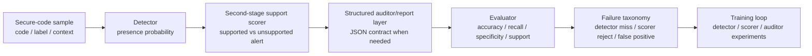

# VeriSec Forge

**Verifiable benchmarking and post-training for trustworthy secure-code reasoning.**

VeriSec Forge is a research-first codebase for studying whether open-weight models can make **trustworthy security judgments about code**. The project focuses on **defensive analysis**, not exploit generation: given a code snippet, the system must decide whether a vulnerability is present, optionally assign a weakness label, expose support for the decision, and stay inside a machine-checkable evaluation contract.

This repository is built to answer a practical research question:

> Can we build a secure-code reasoning system where detection, support checking, structured reporting, and failure analysis are evaluated separately instead of blurred into one generative score?


## Why This Repo Exists

Most secure-code LLM demos blur together several different failure modes:

- the model judged the code incorrectly
- the model used the right label but the wrong rationale
- the output format broke, so the benchmark undercounted it
- the model was confidently wrong
- a second-pass verifier improved recall, but only by becoming noisy

VeriSec Forge is designed to **untangle those cases**. It combines:

- structured secure-code tasks
- JSON-first prompting and parser-aware recovery
- automated evaluation
- failure taxonomy
- detector-first, scorer, SFT, DPO, and verifier experiments
- reproducible reports and diagnostics

## Current Headline Results

The current main conclusion is architectural:

- a discriminative detector should be the first-class vulnerability decision model
- a narrow second-stage support scorer is a better confirmation layer than a miniature generative auditor
- the structured auditor remains useful for machine-readable reports, but it is not the strongest detector

The important result is not the same-source score by itself. The same-source detector reaches high accuracy, but paired evaluation shows that this was artifact-sensitive. The robust direction is paired patch/diff reasoning:

- `PrimeVul paired diff-only detector`
- `Qwen2.5-Coder-1.5B-Instruct`, LoRA sequence classification
- deduplicated paired eval set with exact/near-duplicate diff rows removed
- three-seed balanced-accuracy mean: `0.8287`
- three-seed range: `0.8158-0.8382`
- strongest negative-control balanced accuracy: `0.5156`

Important caveat:

- the original same-source `PrimeVul holdout2000` result is `presence_accuracy = 0.9524`, `recall = 0.9709`, `specificity = 0.9339`, and `f1 = 0.9533`
- this is currently a `PrimeVul same-source / artifact-sensitive presence detector` result
- shortcut diagnostics show that project identity and code length are already highly predictive on this split
- project-majority baseline reaches `f1 = 0.8369`; length-threshold baseline reaches `f1 = 0.7259`
- paired evaluation is now the strongest sanity split: length-threshold accuracy drops to `0.5200`, and the existing detector falls to `accuracy = 0.4933` with `safe_specificity = 0.0111`
- threshold sweep does not fix this paired failure: best balanced accuracy is only `0.4961`, because both vulnerable and fixed/safe paired samples receive saturated vulnerability probabilities
- first paired-only training improves the collapse mode but not the task: default `safe_specificity` rises to `0.4433`, yet best paired balanced accuracy is still only `0.5072`
- pair-context training is the first positive harder-split result: giving the model both candidate and paired counterpart reaches `balanced_accuracy = 0.6061`, `recall = 0.6589`, `specificity = 0.5533`, and `f1 = 0.6259`
- diff-only training is the current best harder-split result: representing candidate-vs-counterpart as a unified diff reaches `balanced_accuracy = 0.8156`, `recall = 0.8022`, `specificity = 0.8289`, and `f1 = 0.8131`
- after removing 8 exact/near-duplicate eval rows flagged by train/eval overlap diagnostics, diff-only remains stable at best balanced accuracy `0.8158`
- multi-seed diff-only training on the deduplicated eval set is stable in the `0.82-0.84` balanced-accuracy range, with three-seed mean `0.8287`
- candidate-only control stays near chance with best balanced accuracy `0.5078`, which supports that the diff-only gain comes from vulnerability-repair differences rather than single-snippet artifacts
- metadata-only and counterpart-only controls also stay near chance, with best balanced accuracy `0.5022` and `0.5156`
- candidate-plus-diff training reaches best balanced accuracy `0.6728`, below diff-only, suggesting that extra full-candidate context dilutes the key patch signal for this 1.5B model
- strict project-disjoint evaluation is not feasible from the current 6k sampled pool because it has no project-disjoint safe examples
- treat the same-source detector result as artifact-sensitive; treat paired diff reasoning as the current robust mainline

For the generated main-results table, see [PrimeVul Main Results](reports/PRIMEVUL_MAIN_RESULTS.md). It is rebuilt from run artifacts by `scripts/build_primevul_main_results.py`.

For the current paired diff error breakdown, see [PrimeVul Paired Diff Failure Analysis](reports/PRIMEVUL_PAIR_DIFF_FAILURE_ANALYSIS.md). The main remaining errors are balanced between false positives and false negatives (`153` FP / `177` FN at threshold `0.6`), with the highest error rates on very small and very large diffs.

Support-scorer ablation result:

- detector-only / probability pass-through is stronger than the current support scorer
- full support scorer: `presence_accuracy = 0.9272`, `f1 = 0.9265`
- support scorer should currently be treated as a diagnostic second-stage interface, not the source of the PrimeVul detection gain

Important boundary result:

- on `CodeXGLUE`, the same second-stage scorer behaves mainly as a conservative policy layer
- best scorer grid point: `presence_accuracy = 0.6055`, `f1 = 0.5489`
- detector-only remains stronger on that benchmark: `presence_accuracy = 0.6135`, best held-out `f1 = 0.6741`

### Snapshot on `eval244`

| Model | Label Accuracy | Format Pass Rate | High-Confidence Error Rate |
| --- | ---: | ---: | ---: |
| Base 0.5B | 0.4098 | 0.5410 | 0.1639 |
| SFT 0.5B | 0.4795 | 0.8279 | 0.0287 |
| SFT 0.5B (`safe->none`) | **0.4959** | 0.8033 | 0.0328 |
| Base 1.5B | 0.0697 | 0.8484 | 0.1066 |

### Snapshot on `holdout1000`

| Model | Label Accuracy | Format Pass Rate | High-Confidence Error Rate |
| --- | ---: | ---: | ---: |
| Base 0.5B | 0.2920 | 0.6930 | 0.1700 |
| SFT 0.5B | 0.4200 | 0.7820 | 0.0220 |
| SFT 0.5B (`safe->none`) | **0.4540** | **0.8150** | 0.0290 |

## Main Research Takeaways So Far

- **Detector-first modeling is the strongest current path.**
  PrimeVul shows that a narrow presence detector can learn the vulnerable-vs-safe boundary much better than a monolithic generative auditor.
- **Second-stage scoring should be treated as a diagnostic interface unless it beats detector-only.**
  PrimeVul ablations show the current support scorer does not improve the detector end-to-end.
- **The PrimeVul detector result is strong, so it now needs protection.**
  Shortcut-controlled evaluation changed the interpretation: project-majority and length-threshold baselines are strong on the same-source holdout, while paired evaluation removes the length shortcut and exposes a severe safe-specificity collapse.
- **Pair-context modeling is the first robust next step.**
  Treating vulnerable/fixed examples as paired comparisons beats independent snippet classification on the paired split, which makes comparative detector training a stronger research direction than simply scaling same-source classifiers.
- **Diff reasoning is the strongest current formulation.**
  A diff-only detector substantially outperforms pair-context text, suggesting the project should pivot from standalone vulnerability detection toward secure patch/diff reasoning.
- **Negative controls now protect the diff result.**
  Metadata-only, candidate-only, and counterpart-only variants all remain near chance, so the diff-only gain is not explained by simple metadata leakage or single-sided code artifacts.
- **Overlap diagnostics do not explain the diff result.**
  Exact and near-duplicate diff overlap exists but is tiny; removing the flagged eval rows leaves the diff-only score essentially unchanged.
- **The diff-only result is not a one-seed fluke.**
  Three deduplicated-eval runs land at balanced accuracy `0.8158`, `0.8382`, and `0.8321`, so the current result is better described as a stable operating band than a lucky single checkpoint.
- **More context is not automatically better for small models.**
  Candidate-plus-diff beats candidate-only and pair-context variants but remains far below diff-only, so the current best task design is the cleanest patch signal rather than the longest input.
- **CodeXGLUE remains detector-limited.**
  At the best scorer point, most false negatives are detector misses, not scorer rejections.
- **Completion-only SFT remains a useful structured-auditor baseline.**
  It improved JSON stability and calibration, but it is no longer the main route to best detection.
- **DPO has not beaten the SFT anchor.**
  Several secure-code DPO variants degraded either output structure or semantic reliability.
- **Verifier-style second review is interesting, but not solved.**
  We found real recall signal, especially in failure-driven verifier training, but no verifier variant has yet produced a trustworthy net gain over the main auditor.

## What the Model Must Output

The core secure-code task uses a structured JSON contract like:

```json
{
  "has_vulnerability": true,
  "vulnerability_type": "cwe-79",
  "severity": "medium",
  "evidence": [
    {
      "file_path": "src/app.py",
      "line_start": 18,
      "line_end": 20,
      "snippet": "render(user_input)"
    }
  ],
  "explanation": "Unsanitized user-controlled data reaches an HTML sink.",
  "fix_principle": "Validate and encode untrusted input before rendering.",
  "confidence": 0.82,
  "fix_choice": ""
}
```

The stack also supports tolerant parsing and second-pass recovery for JSON-like generations, so we can distinguish:

- parser/protocol failure
- semantic failure
- calibration failure

## System Overview



## Repository Contents

- [src/vrf](src/vrf)  
  Core inference, parsing, evaluation, analysis, training, and serving code.

- [configs](configs)  
  Runnable experiment configs for baseline, SFT, DPO, verifier, and reporting pipelines.

- [scripts](scripts)  
  Dataset preparation, benchmark building, diagnostics, and report generation utilities.

- [reports](reports)  
  Research summary, technical report, visual diagnostics, and experiment comparisons.

- [analysis](analysis)  
  Failure-analysis artifacts for completed runs.

- [data](data)  
  Small benchmark slices and data layout notes. Large raw corpora and generated training datasets are not tracked by default.

## Quick Start

### 1. Install

```powershell
python -m venv .venv
.venv\Scripts\Activate.ps1
python -m pip install -e .[dev]
```

### 2. Run the mock secure-code pipeline

```powershell
vrf baseline --config configs\baseline_secure_code_mock.json
vrf evaluate --config configs\eval_secure_code_mock.json
vrf analyze --config configs\analysis_secure_code_mock.json
```

### 3. Run the real `PrimeVul` 0.5B baseline on `eval244`

```powershell
vrf baseline --config configs\baseline_secure_code_primevul_qwen05b_eval244.json
vrf evaluate --config configs\eval_secure_code_primevul_qwen05b_eval244.json
vrf analyze --config configs\analysis_secure_code_primevul_qwen05b_eval244.json
```

### 4. Run the current best SFT checkpoint on `eval244`

```powershell
vrf baseline --config configs\baseline_sft_secure_code_primevul_qwen05b_balanced_safe_none_only_v1_eval244.json
vrf evaluate --config configs\eval_sft_secure_code_primevul_qwen05b_balanced_safe_none_only_v1_eval244.json
vrf analyze --config configs\analysis_sft_secure_code_primevul_qwen05b_balanced_safe_none_only_v1_eval244.json
```

## Core Experiment Tracks

### Detector and scorer mainline

- PrimeVul presence-only detector
- PrimeVul detector + support scorer
- CodeXGLUE full-balanced detector
- CodeXGLUE detector + support scorer
- threshold grids and scorer failure breakdowns

### Structured auditor baselines

- Base 0.5B
- Base 1.5B
- completion-only SFT
- safe-label cleanup SFT
- evidence-focused SFT

### Preference tuning

- hard DPO
- calibrated DPO
- label-focused LoRA-only DPO

### Verifier branch

- self-verifier
- generic strict verifier
- failure-driven verifier
- compact verifier
- decision-only verifier
- binary-judge verifier
- label-only verifier

The key result here is not just "which one is best", but **which designs fail in what way**.

## Best Places to Start Reading

If you want the fast overview:

- [reports/SECURE_CODE_RESEARCH_SUMMARY.md](reports/SECURE_CODE_RESEARCH_SUMMARY.md)
- [docs/ARCHITECTURE.md](docs/ARCHITECTURE.md)
- [reports/RESULTS_INDEX.md](reports/RESULTS_INDEX.md)

If you want the fuller methods and results:

- [reports/TECHNICAL_REPORT.md](reports/TECHNICAL_REPORT.md)
- [docs/EXPERIMENT_WORKFLOWS.md](docs/EXPERIMENT_WORKFLOWS.md)

If you want experiment-by-experiment comparisons:

- [reports/training_comparison.md](reports/training_comparison.md)

If you want the failure and calibration diagnostics:

- [reports/SECURE_CODE_DIAGNOSTICS.md](reports/SECURE_CODE_DIAGNOSTICS.md)
- [reports/SECURE_CODE_VISUAL_DIAGNOSTICS.md](reports/SECURE_CODE_VISUAL_DIAGNOSTICS.md)

## What Gets Versioned

This GitHub repository is designed to track:

- source code
- configs
- small benchmark slices
- research reports

It intentionally does **not** track:

- large raw datasets
- full processed training corpora
- generated outputs
- checkpoints

See [data/README.md](data/README.md) for the data layout and regeneration notes.

## Environment Notes

- The active local workflow runs on Windows with CLI, FastAPI, Hugging Face, and TRL-based training entrypoints.
- `vLLM` is still the preferred Linux GPU serving path for a future serving-focused version.
- The published repository is a research artifact and reproducible experiment stack, not a general-purpose secure coding assistant.

## Project Status

This repository is already useful as:

- a secure-code reasoning benchmark harness
- a structured post-training testbed
- a detector + second-stage scorer research prototype
- a failure-taxonomy and calibration study
- a negative-result record for verifier and DPO variants that did **not** beat the SFT anchor

That last point matters: the repo does not only record what worked, but also what looked promising and then failed under stricter evaluation.
