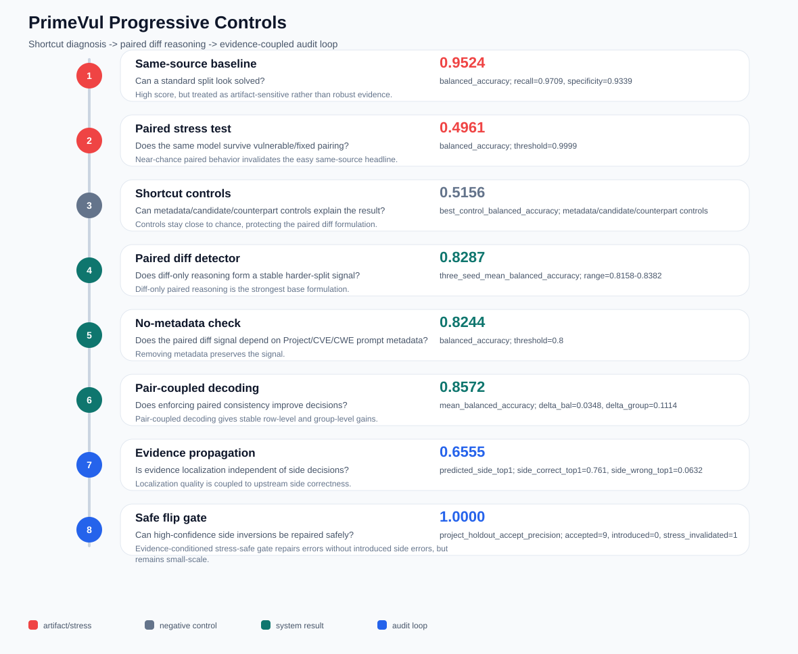
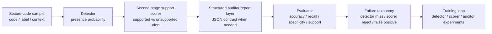

# VeriSec Forge

**Verifiable benchmarking and post-training for trustworthy secure-code reasoning.**

VeriSec Forge is a research-first codebase for studying whether open-weight models can make **trustworthy security judgments about security patches and code diffs**. The project focuses on **defensive analysis**, not exploit generation: given a vulnerable/fixed pair or patch-like diff, the system must decide which side is riskier, expose support for the decision, and stay inside a machine-checkable evaluation contract.

This repository is built to answer a practical research question:

> Can we build a shortcut-aware secure patch/diff reasoning benchmark and detector stack where paired decisions, support checking, structured reporting, and failure analysis are evaluated separately instead of blurred into one generative score?


## Quick Start

| Goal | Entry point |
| --- | --- |
| Read the research narrative | [Project Story](PROJECT_STORY.md) |
| Try the artifact-backed patch review demo | [Patch Review Demo](docs/PATCH_REVIEW_DEMO.md) |
| Inspect the main result table | [PrimeVul Progressive Controls](reports/PRIMEVUL_PROGRESSIVE_CONTROLS.md) |
| Reproduce manifest-backed artifacts | [Reproducibility Guide](REPRODUCIBILITY.md) |
| Browse all reports and diagnostics | [Results Index](reports/RESULTS_INDEX.md) |

Run the local patch-review UI:

```powershell
.\.venv\Scripts\python.exe -m vrf.cli serve --config configs/serve_patch_review_demo.json
```

Then open `http://127.0.0.1:8000/review-pair/ui`.

## Research Snapshot




## Why This Repo Exists

Most secure-code LLM demos blur together several different failure modes:

- the model judged the code incorrectly
- the model used the right label but the wrong rationale
- the output format broke, so the benchmark undercounted it
- the model was confidently wrong
- a second-pass verifier improved recall, but only by becoming noisy

VeriSec Forge is designed to **untangle those cases**. It combines:

- structured secure-code tasks
- JSON-first prompting and parser-aware recovery
- automated evaluation
- failure taxonomy
- detector-first, scorer, SFT, DPO, and verifier experiments
- reproducible reports and diagnostics

## Current Headline Results

The short version:

- Standard same-source vulnerability detection can look solved while still being shortcut-prone.
- PrimeVul same-source detection reaches `0.9524` accuracy, but paired vulnerable/fixed evaluation exposes that result as artifact-sensitive.
- Paired diff reasoning is the credible mainline: diff-only training reaches a three-seed balanced-accuracy mean of `0.8287`.
- Negative controls stay near chance: metadata-only `0.5022`, candidate-only `0.5078`, and counterpart-only `0.5156` balanced accuracy.
- Pair-coupled decoding is the strongest current system layer, reaching five-split mean balanced accuracy `0.8572` and mean group all-correct gain `+0.1114`.
- Evidence localization is useful as failure triage, but it remains pseudo-label/pilot-audit driven until independent adjudication is complete.
- The patch review demo exposes this stack as an artifact-backed reviewer UI, not as an arbitrary online vulnerability scanner.

For the compact generated table, see [PrimeVul Progressive Controls](reports/PRIMEVUL_PROGRESSIVE_CONTROLS.md). For the full generated result inventory, see [PrimeVul Main Results](reports/PRIMEVUL_MAIN_RESULTS.md). For the research narrative, see [Project Story](PROJECT_STORY.md).

<details>
<summary>Detailed historical experiment notes</summary>

The current main conclusion is architectural:

- a discriminative detector should be the first-class vulnerability decision model
- a narrow second-stage support scorer is a better confirmation layer than a miniature generative auditor
- the structured auditor remains useful for machine-readable reports, but it is not the strongest detector
- the strongest current system result is not standalone vulnerability detection; it is pair-coupled decoding for paired vulnerable/fixed patch examples

The important result is not the same-source score by itself. The same-source detector reaches high accuracy, but paired evaluation shows that this was artifact-sensitive. The robust direction is paired patch/diff reasoning:

- `PrimeVul paired diff-only detector`
- `Qwen2.5-Coder-1.5B-Instruct`, LoRA sequence classification
- deduplicated paired eval set with exact/near-duplicate diff rows removed
- three-seed balanced-accuracy mean: `0.8287`
- three-seed range: `0.8158-0.8382`
- strongest negative-control balanced accuracy: `0.5156`

Important caveat:

- the original same-source `PrimeVul holdout2000` result is `presence_accuracy = 0.9524`, `recall = 0.9709`, `specificity = 0.9339`, and `f1 = 0.9533`
- this is currently a `PrimeVul same-source / artifact-sensitive presence detector` result
- shortcut diagnostics show that project identity and code length are already highly predictive on this split
- project-majority baseline reaches `f1 = 0.8369`; length-threshold baseline reaches `f1 = 0.7259`
- paired evaluation is now the strongest sanity split: length-threshold accuracy drops to `0.5200`, and the existing detector falls to `accuracy = 0.4933` with `safe_specificity = 0.0111`
- threshold sweep does not fix this paired failure: best balanced accuracy is only `0.4961`, because both vulnerable and fixed/safe paired samples receive saturated vulnerability probabilities
- first paired-only training improves the collapse mode but not the task: default `safe_specificity` rises to `0.4433`, yet best paired balanced accuracy is still only `0.5072`
- pair-context training is the first positive harder-split result: giving the model both candidate and paired counterpart reaches `balanced_accuracy = 0.6061`, `recall = 0.6589`, `specificity = 0.5533`, and `f1 = 0.6259`
- diff-only training is the current best harder-split result: representing candidate-vs-counterpart as a unified diff reaches `balanced_accuracy = 0.8156`, `recall = 0.8022`, `specificity = 0.8289`, and `f1 = 0.8131`
- after removing 8 exact/near-duplicate eval rows flagged by train/eval overlap diagnostics, diff-only remains stable at best balanced accuracy `0.8158`
- multi-seed diff-only training on the deduplicated eval set is stable in the `0.82-0.84` balanced-accuracy range, with three-seed mean `0.8287`
- group-level paired evaluation now reports `877` unique pair groups, `0.6978` group all-correct rate, and `0.8424` probability-orientation accuracy
- removing `Project`, `CVE`, and `CWE` prompt metadata does not break the result: `diff_no_metadata` reaches best balanced accuracy `0.8244`
- targeted edge-focus training shows a useful but not-yet-stable signal: seed42 reaches best balanced accuracy `0.8348`, but seed7 and seed99 reach `0.8164` and `0.8226`, so this should be treated as exploratory rather than a confirmed improvement over the original diff-only multi-seed band
- hunk-localized diff training reaches best balanced accuracy `0.8298`; direct transfer from the original diff-only checkpoint to localized inputs drops to `0.7981`, so compression needs its own training rather than being a free inference-time trick
- aggressive `26+` large-diff localization reaches best bucket balanced accuracy `0.7334`, below the edge-focus bucket result `0.7438`; shortening alone is not enough without contrastive evidence-window selection
- contrastive-window training reaches full deduplicated best balanced accuracy `0.8270`, but only `0.7075` on the `26+` bucket, so explicit counterpart-vs-candidate windows expose the recall/specificity tradeoff without solving it
- `26+` direction-aware error-window mining shows FP and FN windows share the same surface security keywords (`len`, `size`, `mem`, `valid`), while FP windows often add protection and FN windows often remove protection; the next localizer should score candidate-side directionality rather than keyword salience alone
- a first direction-aware transfer check is negative: the existing edge-focus checkpoint collapses on the new template, with best `26+` balanced accuracy only `0.5377`, so the valid next test is same-template direction-aware training rather than inference-time prompt rewriting
- matched direction-aware training recovers the full paired-diff band with best full-eval balanced accuracy `0.8225` and improves the hard `26+` bucket to best balanced accuracy `0.7721`, above the previous edge-focus bucket result `0.7438`
- the direction-aware `26+` gain comes from a different error profile: false positives fall from `28` to `12`, while false negatives rise from `13` to `24`, so the next step is recall recovery without losing the new specificity gain
- recall-recovery v1 oversamples same-template training rows for vulnerable `26+` and mixed-risk windows; it reaches the strongest `26+` bucket result so far, best balanced accuracy `0.7904`, but full-eval balanced accuracy falls slightly to `0.8180`
- recall-recovery v2 is a negative ablation: reducing vulnerable duplication and adding more safe anchors drops full-eval balanced accuracy to `0.8074` and `26+` best balanced accuracy to `0.7077`
- bucket-specific routing is the next positive systems result: keeping the baseline direction-aware detector for non-`26+` rows and routing `26+` rows to recall-recovery v1 reaches full-eval balanced accuracy `0.8231`; at the `0.8` bucket threshold it also reaches group all-correct rate `0.7241` and pair orientation accuracy `0.8624`
- validation-selected routing now uses raw-count selection scores rather than rounded table metrics: calibration selects bucket threshold `0.7`; on held-out pair groups, row-level balanced accuracy stays at `0.8136`, while group all-correct moves from `0.7101` to `0.7117` and orientation accuracy improves from `0.8514` to `0.8581`
- router statistics keep this claim honest: group all-correct delta is only `+0.0016` with bootstrap 95% CI `-0.0098-0.0130`, while orientation delta is `+0.0068` with bootstrap 95% CI `0.0017-0.0151` but exact sign-test p=`0.125`
- pair-coupled decoding is the next strong systems result: without using gold labels, it enforces one vulnerable and one safe decision within paired groups when the probability gap clears a calibrated margin; on held-out pair groups it reaches balanced accuracy `0.8493`, group all-correct `0.8208`, and bootstrap group all-correct delta `+0.1091` over the bucket router
- multi-split stability now protects the pair-coupled claim: over split seeds `7,13,42,99,123`, pair-coupled decoding has mean balanced accuracy `0.8572`, mean group all-correct `0.8339`, mean pair-minus-bucket balanced accuracy `+0.0348`, and mean pair-minus-bucket group all-correct `+0.1114`
- heuristic pair evidence localization is now the first explanation layer: on the pair-coupled held-out rows, support rate is `0.6376` and pseudo-localization accuracy is `0.6003`; supported predictions have error rate `0.0933`, while unsupported predictions have error rate `0.2516`, so evidence support is useful for failure triage even without gold evidence spans
- hunk-level pseudo-label datasets now define the next localizer target: train has `4697` hunk rows with top-1/top-8 coverage `0.5575/0.5822`, while eval has `2536` hunk rows with top-1/top-8 coverage `0.5792/0.6150`; this shows current keyword ranking leaves measurable but bounded room for learned hunk scoring
- a dependency-free linear hunk scorer gives a small reranking gain: eval top-1 coverage rises from `0.5792` to `0.5954`, and top-2 from `0.6066` to `0.6133`; top-3 and above stay capped at `0.6150`, showing the next bottleneck is candidate hunk recall, not just scoring
- candidate generation is now the stronger evidence-localization lever: line-window candidates lift eval top-8 coverage to `0.7070`, and hunk+window reaches `0.7073`, versus `0.6150` for hunk-only candidates
- a hunk+window linear scorer closes much of that gap at early ranks: eval top-1 coverage rises from `0.5792` to `0.6178`, top-3 from `0.6676` to `0.6877`, and top-5 reaches `0.7029` against the `0.7073` top-8 ceiling
- a side-aware hunk+window scorer reaches the current pseudo-label ceiling at top-1 (`0.7073`, vulnerable `0.7039`, safe `0.7108`), but this is a diagnostic upper bound because it uses the target decision side for feature alignment; the deployment-facing next step is to feed it the pair-coupled predicted side and measure error propagation
- the first predicted-side propagation check is healthy but revealing: on pair-coupled matched rows, oracle side-aware top-1 coverage is `0.7184`, pair-coupled predicted-side top-1 coverage is `0.6555`, and side-correct rows reach `0.7610` while side-wrong rows fall to `0.0632`
- predicted-side failure taxonomy shows the remaining side errors are balanced (`95` FP / `95` FN), concentrated in small diffs (`00-02`: `59`) and high-gap confident mistakes (`50+`: `86`), with top-hunk positive rate only `0.0632` on wrong-side rows
- a confident side-inversion hard-negative set is now defined: `gap >= 0.50` yields `86` rows across `43` pair groups, exactly balanced at `43` FP / `43` FN, with average probability gap `0.8225`
- a first lightweight pair-side correction gate is a negative/flat ablation: seed42 moves balanced accuracy from `0.8470` to `0.8481`, but five pair-key splits have mean balanced-accuracy delta about `0.0000` and mean group all-correct delta `-0.0019`
- contrastive pseudo-evidence aggregation is also not enough: adding hunk/window risk-safety features gives five-split balanced-accuracy delta mean `-0.0002` and group all-correct delta mean `-0.0047`, despite a seed42 bump to `0.8504`
- the next side-correction input is now materialized as a paired-window contrastive dataset: `592` mixed pair groups are rendered as high-probability-side vs low-probability-side examples, with `83` label-`B` orientation inversions and `44` high-gap inversions at `gap >= 0.50`; this is a model-ready hard-negative/calibration artifact, not a new performance result
- a first dependency-free paired-window side model confirms the new target has signal: across five pair-key splits, balanced accuracy rises from the always-trust-high-probability baseline `0.5000` to mean `0.6065`, with label-`B` inversion recall `0.4367`; overall accuracy drops from `0.8598` to `0.7328`, while top-5 flip precision reaches mean `0.72`, so the current model is better framed as a high-priority review queue than a deployable default flipper
- that review-queue artifact is now materialized: taking the top-5 side-inversion candidates from each of five pair-key splits yields `25` rows, `16` unique pair keys, and `0.72` diagnostic precision; the queue includes compact side-A/side-B evidence windows and prompts for the next verifier stage
- a strict side-inversion verifier target is now defined from that queue: `25` rows become `18` accept-flip and `7` reject-flip examples under a fixed JSON contract, with average prompt length `2873.2` characters; this is the next supervised verifier/review target, not an automatic correction result
- lightweight verifier baselines set the next bar: `side_model_score` thresholds still accept all reject cases, while combining multi-split queue consensus with evidence margin reaches `1.0` accept precision on `10` accepted flips and `0.5556` accept recall; a trained verifier must improve recall without losing this precision-first behavior
- the precision-first rule is now materialized as a safe flip gate: on the offline review queue, the strict operating point (`pair_repeat_count>=3 OR evidence_score>=13`) accepts `10` rows across `4` unique pairs, repairs `10` row-level side errors, and introduces `0` side errors; this is a gated operating point for future validation, not a full-benchmark automatic correction claim
- a rank-holdout queue now stress-tests that gate beyond the top-5 candidates: ranks `6-10` have much lower candidate precision (`0.32`), but the strict gate remains conservative, accepting only `2` rows with `1.0` accept precision and `0` introduced side errors
- a fresh-seed candidate check exposes the safety/recall tradeoff more sharply: new top-5 candidate seeds have queue precision `0.52`; the old threshold (`evidence_score>=10`) accepts `10` rows with `0.90` precision and `1` introduced side error, while the strict operating point accepts `9` rows with `1.0` precision and `0` introduced errors
- a project-heldout candidate check is stricter and more sobering: project-disjoint top-5 candidates have queue precision `0.48`; the in-pool strict gate (`repeat>=3 OR evidence>=13`) drops to `0.75` precision with `3` introduced side errors, while an evidence-conditioned gate (`evidence>=13 OR (repeat>=3 AND evidence>=0)`) restores `1.0` precision and `0` introduced errors while accepting `9` rows
- the cross-pool side-inversion gate summary is now generated from run artifacts with an explicit selection protocol: strict gates stay zero-introduced on top-5, rank-holdout, and fresh-seed pools, but project-heldout marks the unconditional repeat-consensus path as `stress_invalidated`; the evidence-conditioned project-heldout gate is the current `preferred_stress_safe` operating point
- candidate-only control stays near chance with best balanced accuracy `0.5078`, which supports that the diff-only gain comes from vulnerability-repair differences rather than single-snippet artifacts
- metadata-only and counterpart-only controls also stay near chance, with best balanced accuracy `0.5022` and `0.5156`
- candidate-plus-diff training reaches best balanced accuracy `0.6728`, below diff-only, suggesting that extra full-candidate context dilutes the key patch signal for this 1.5B model
- strict project-disjoint evaluation is not feasible from the current 6k sampled pool because it has no project-disjoint safe examples
- treat the same-source detector result as artifact-sensitive; treat paired diff reasoning as the current robust mainline

For the generated main-results table, see [PrimeVul Main Results](reports/PRIMEVUL_MAIN_RESULTS.md). It is rebuilt from run artifacts by `scripts/build_primevul_main_results.py`.

For a compact application-style narrative table, see [PrimeVul Progressive Controls](reports/PRIMEVUL_PROGRESSIVE_CONTROLS.md). It compresses the same-source shortcut diagnosis, paired diff controls, pair-coupled decoding, and evidence/gate audit loop into one generated table.

For a one-page application summary, see [Application One-Pager](APPLICATION_ONE_PAGER.md).

For the current side-inversion gate comparison, see [PrimeVul Side-Inversion Gate Summary](reports/PRIMEVUL_SIDE_INVERSION_GATE_SUMMARY.md). It is generated from the safe-flip gate reports, includes the gate selection protocol, and highlights the project-heldout evidence-conditioned operating point.

For a lightweight reviewer-facing system demo, see [Patch Review Demo](docs/PATCH_REVIEW_DEMO.md). It reads the manifest-backed PrimeVul paired artifacts and returns a compact JSON or browser UI view of the pair-coupled decision, support label, evidence windows, and caveats. It is artifact-backed and should not be described as online scanning for arbitrary new code.

For the manual evidence-span audit loop, see [Manual Evidence Audit Loop](reports/PRIMEVUL_MANUAL_EVIDENCE_AUDIT_LOOP.md), [Manual Evidence Audit Guide](docs/MANUAL_EVIDENCE_AUDIT_GUIDE.md), [PrimeVul Manual Evidence Audit Set](reports/PRIMEVUL_MANUAL_EVIDENCE_AUDIT_SET.md), [PrimeVul Manual Evidence Pilot Findings](reports/PRIMEVUL_MANUAL_EVIDENCE_PILOT_FINDINGS.md), and [PrimeVul Manual Evidence Adjudication Workflow](reports/PRIMEVUL_MANUAL_EVIDENCE_ADJUDICATION_WORKFLOW.md). The first version materializes `42` unique high-signal pair keys from side-inversion queues, completes a `codex_pilot` audit over all `42`, and turns the resulting `6` high-quality disagreements plus `14` insufficient-context cases into reviewer-facing adjudication queues.

Important evidence-audit caveat: the `codex_pilot` annotations and `codex_draft` adjudication suggestions are triage artifacts, not independent human gold. The reviewer-confirmed artifact begins with the adjudication CSV workflow and should be reported separately from the pilot.

For reproducibility, see [REPRODUCIBILITY](REPRODUCIBILITY.md). The calibrated router now has a manifest-backed reproduction script that validates required local artifacts by SHA256 before regenerating the report.

The Evidence-Coupled chain is also manifest-backed: `scripts/reproduce_primevul_evidence_coupled.py` validates hunk+window candidates, pair-coupled predictions, generated localization artifacts, failure taxonomy, and the confident side-inversion set before reporting success.

For bundle-assisted reviewer reproduction, see [Artifact Bundle Workflow](reproducibility/ARTIFACT_BUNDLE.md). `scripts/build_reproducibility_bundle.py` checks manifest-listed local inputs and can package them into a gitignored zip with an internal `BUNDLE_MANIFEST.json`; `scripts/restore_reproducibility_bundle.py` restores that bundle conservatively into a fresh clone; `scripts/download_reproducibility_bundle.py` is ready to download and verify the public bundle once `reproducibility/release_artifacts.json` has a URL. The local bundle hash/size and upload steps are tracked in [Artifact Release Checklist](reproducibility/RELEASE_CHECKLIST.md).

For the current paired diff error breakdown, see [PrimeVul Paired Diff Failure Analysis](reports/PRIMEVUL_PAIR_DIFF_FAILURE_ANALYSIS.md). The main remaining errors are balanced between false positives and false negatives (`153` FP / `177` FN at threshold `0.6`), with the highest error rates on very small and very large diffs.

The first reviewer-facing metadata control is now complete: `diff_no_metadata` removes `Project`, `CVE`, and `CWE` from the prompt and leaves only the task instruction plus unified diff. It reaches best balanced accuracy `0.8244`, so the paired diff result is not explained by prompt metadata alone. See [PrimeVul Diff Edge-Focus Plan](reports/PRIMEVUL_DIFF_EDGE_FOCUS_PLAN.md) for the no-metadata and edge-focus experiment configs.

Support-scorer ablation result:

- detector-only / probability pass-through is stronger than the current support scorer
- full support scorer: `presence_accuracy = 0.9272`, `f1 = 0.9265`
- support scorer should currently be treated as a diagnostic second-stage interface, not the source of the PrimeVul detection gain

Important boundary result:

- on `CodeXGLUE`, the same second-stage scorer behaves mainly as a conservative policy layer
- best scorer grid point: `presence_accuracy = 0.6055`, `f1 = 0.5489`
- detector-only remains stronger on that benchmark: `presence_accuracy = 0.6135`, best held-out `f1 = 0.6741`

### Snapshot on `eval244`

| Model | Label Accuracy | Format Pass Rate | High-Confidence Error Rate |
| --- | ---: | ---: | ---: |
| Base 0.5B | 0.4098 | 0.5410 | 0.1639 |
| SFT 0.5B | 0.4795 | 0.8279 | 0.0287 |
| SFT 0.5B (`safe->none`) | **0.4959** | 0.8033 | 0.0328 |
| Base 1.5B | 0.0697 | 0.8484 | 0.1066 |

### Snapshot on `holdout1000`

| Model | Label Accuracy | Format Pass Rate | High-Confidence Error Rate |
| --- | ---: | ---: | ---: |
| Base 0.5B | 0.2920 | 0.6930 | 0.1700 |
| SFT 0.5B | 0.4200 | 0.7820 | 0.0220 |
| SFT 0.5B (`safe->none`) | **0.4540** | **0.8150** | 0.0290 |

</details>

## Main Research Takeaways So Far

- **Detector-first modeling is the strongest current path.**
  PrimeVul shows that a narrow presence detector can learn the vulnerable-vs-safe boundary much better than a monolithic generative auditor.
- **Second-stage scoring should be treated as a diagnostic interface unless it beats detector-only.**
  PrimeVul ablations show the current support scorer does not improve the detector end-to-end.
- **The PrimeVul detector result is strong, so it now needs protection.**
  Shortcut-controlled evaluation changed the interpretation: project-majority and length-threshold baselines are strong on the same-source holdout, while paired evaluation removes the length shortcut and exposes a severe safe-specificity collapse.
- **Pair-context modeling is the first robust next step.**
  Treating vulnerable/fixed examples as paired comparisons beats independent snippet classification on the paired split, which makes comparative detector training a stronger research direction than simply scaling same-source classifiers.
- **Diff reasoning is the strongest current formulation.**
  A diff-only detector substantially outperforms pair-context text, suggesting the project should pivot from standalone vulnerability detection toward secure patch/diff reasoning.
- **Negative controls now protect the diff result.**
  Metadata-only, candidate-only, and counterpart-only variants all remain near chance, so the diff-only gain is not explained by simple metadata leakage or single-sided code artifacts.
- **Overlap diagnostics do not explain the diff result.**
  Exact and near-duplicate diff overlap exists but is tiny; removing the flagged eval rows leaves the diff-only score essentially unchanged.
- **The diff-only result is not a one-seed fluke.**
  Three deduplicated-eval runs land at balanced accuracy `0.8158`, `0.8382`, and `0.8321`, so the current result is better described as a stable operating band than a lucky single checkpoint.
- **Edge-focused oversampling is promising but unstable.**
  The edge-focus run improved seed42, but two extra seeds fell back near the original diff-only band. The next improvement should target structural diff compression/localization, not just more replacement oversampling.
- **Localized diffs are viable but not yet a breakthrough.**
  A localized-diff detector recovers to `0.8298` best balanced accuracy after retraining, while direct transfer from the original diff-only checkpoint reaches only `0.7981`. This points toward better large-diff localization as the next research lever.
- **Large-diff localization needs contrast, not just compression.**
  The aggressive `26+` localization check improves specificity but loses recall, so the next localizer should preserve vulnerable/fixed changed windows together rather than simply selecting shorter keyword-heavy hunks.
- **Contrastive windows are informative but still not enough.**
  The contrastive detector lands inside the main paired-diff band on full eval, but `26+` specificity remains weak at high recall. The next step should be error-driven window mining, not another generic formatting variant.
- **Direction-aware error windows show why keyword mining fails.**
  In `26+` errors, false positives and false negatives both contain security-looking tokens such as `len`, `size`, and `mem`. The new direction-aware mining pass adds candidate-side signals such as added checks, removed checks, introduced risky calls, and removed risky calls. FP windows are dominated by `candidate_adds_protection`, while FN windows show more `candidate_removes_protection`, so the next localizer should learn operation direction rather than salience alone.
- **Direction-aware templates need matched training.**
  Directly evaluating the edge-focus raw-diff checkpoint on a direction-aware `26+` template collapses toward safe predictions, but matched direction-aware training recovers to `0.8225` best balanced accuracy on full deduplicated eval and reaches `0.7721` on the hard `26+` bucket. This makes operation-direction windows the first structural large-diff variant to beat the previous `26+` bucket best.
- **The new large-diff bottleneck is recall recovery.**
  Direction-aware windows reduce `26+` false positives from `28` to `12`, but false negatives rise from `13` to `24`. The next experiment should preserve this specificity gain while oversampling or reweighting direction-aware false negatives.
- **Recall recovery needs calibration.**
  The first recall-recovery dataset improves the hard `26+` bucket only after threshold tuning: best balanced accuracy reaches `0.7904` at threshold `0.8`, while the default threshold is recall-heavy and noisy. This points toward calibrated operating points rather than a single fixed threshold.
- **More safe anchors are not the fix.**
  The v2 ablation adds more safe anchors and reduces vulnerable duplication, but it over-corrects toward conservatism. The better next step is bucket-specific calibration or routing, not more generic resampling.
- **Bucket routing is useful, but not magic.**
  Routing only `26+` large diffs to the recall-recovery checkpoint gives a small full-eval improvement and exposes two valid operating points: a specificity-preserving threshold and a recall-friendlier threshold. Pair/group metrics now confirm that the default route also improves the comparative signal, with `0.8624` probability-orientation accuracy.
- **Validation-selected routing makes the claim more conservative.**
  A pair-key calibration split now selects bucket threshold `0.7` using raw-count selection scores before table rounding. The held-out gain is mainly in group/pair metrics rather than row-level balanced accuracy. This is the right interpretation: bucket routing is calibration hygiene and comparative-consistency tooling, not a new detector breakthrough.
- **Statistical checks prevent overclaiming.**
  Bootstrap intervals and sign tests show that group all-correct is not a convincing improvement, while orientation has a small positive signal but not enough non-tie pairs for a strong significance claim.
- **Pair-coupled decoding is the first clearly stronger system layer.**
  Because the benchmark is paired by construction, the system can decode pair groups coherently rather than treating each row independently. This improves row-level balance and group all-correct while leaving orientation unchanged, which is exactly what a discrete pair-coupling layer should do.
- **Multi-split checks make the pair-coupled result much harder to dismiss.**
  The improvement is not a seed-42 artifact: five independent pair-key calibration/eval splits all show positive row-level and group-level deltas, with paired tests consistently favorable.
- **Evidence localization is now a failure-triage layer, not yet a gold-span claim.**
  The first heuristic support report scores whether top diff hunks directionally support a vulnerable or safe candidate decision. Unsupported predictions are much more error-prone, and a hunk-limit sweep shows pseudo-localization peaks around top-3 hunks (`0.6051`), so the next research loop has a concrete target: replace heuristic support with learned or human-validated evidence spans.
- **The learned hunk scorer target is now concrete.**
  A pseudo-label builder turns paired diffs into hunk-level training/eval rows. The current keyword hunk ordering covers only `0.5792` of eval rows at top-1 and `0.6150` by top-8, so the immediate question is whether a learned scorer can improve ranking before we invest in more expensive model training.
- **A cheap learned scorer helps, but only at top ranks.**
  The linear hunk scorer improves eval top-1 coverage to `0.5954`, but cannot exceed the same `0.6150` candidate-hunk ceiling by top-3/top-8. The next localizer should improve hunk generation/recall, not only rerank the existing candidates.
- **Window candidates raise the evidence ceiling.**
  Splitting changed hunks into line windows lifts eval top-8 pseudo-label coverage from `0.6150` to about `0.707`, with balanced vulnerable/safe coverage. This means the next learned scorer should rank over hunk+window candidates rather than over original hunks only.
- **The hunk+window scorer is the current localizer baseline.**
  A dependency-free linear scorer over hunk+window candidates reaches eval top-1 `0.6178`, top-3 `0.6877`, and top-5 `0.7029`. It is close to the top-8 candidate ceiling, but its top-1 gain favors vulnerable rows more than safe rows, so the next refinement should calibrate ranking by label side or pair context.
- **Side-aware scoring shows the localizer has an alignment ceiling.**
  When the scorer is allowed to align hunk evidence to the target decision side, hunk+window top-1 coverage reaches `0.7073`, matching the top-8 candidate ceiling with balanced vulnerable/safe coverage. This should be read as an oracle-style diagnostic, not an end-to-end claim, because the current pseudo-label run uses the known side to define aligned evidence. The next real test is to replace that side with the pair-coupled predicted side.
- **Predicted-side localization exposes error propagation.**
  Feeding the hunk scorer the pair-coupled predicted side gives top-1 coverage `0.6555` on the matched held-out subset, versus matched oracle coverage `0.7184`. The split is stark: side-correct rows reach `0.7610`, while side-wrong rows reach only `0.0632`, so the next system target is not just better hunk ranking but better decision-to-evidence coupling.
- **Wrong-side taxonomy points back to pair calibration.**
  The `190` side-wrong rows split evenly into `95` false positives and `95` false negatives. Many are confident pair decisions rather than margin-only mistakes: `86` have probability gap `>=0.50`. Because wrong-side top hunks almost never match the gold pseudo-label (`0.0632`), the next improvement should target side-decision calibration and hard paired negatives before another localizer reranker.
- **Confident inversions are now a concrete training target.**
  The `gap >= 0.50` subset has `86` rows from `43` paired groups, balanced at `43` false positives and `43` false negatives. This is not a new benchmark split because it is selected from current failures; it is a hard-negative calibration set for the next pair-side decision experiment.
- **Cheap pair-side correction is not enough.**
  A logistic gate over probability and bucket features can slightly reduce one false positive on seed42, but multi-split analysis is flat: mean balanced-accuracy delta is about `0.0000`, and group all-correct trends slightly negative. This is useful because it rules out a shallow metadata/probability fix and points toward contrastive pair features or model-level hard-negative training.
- **Hand-built contrastive evidence features are still too weak.**
  Adding hunk/window risk, safety, protection, and direction-count features makes the gate more aggressive but not more reliable. Five-split balanced-accuracy delta is `-0.0002`, and group all-correct delta is `-0.0047`. The implication is clean: the next correction attempt should be an explicit paired-window contrastive model, not another manual feature gate.
- **The paired-window contrastive target is now concrete.**
  The new dataset builder converts pair-coupled predictions and top hunk/window candidates into `A/B` side-comparison examples. `Side A` is the current high-probability side, so label `B` directly marks an orientation inversion. This gives the next model a clean target: learn when the current pair-coupled side should be trusted or flipped.
- **The first paired-window side model finds inversion signal, but is not yet a system win.**
  A cheap linear text/feature model improves held-out balanced accuracy against the always-`A` orientation baseline (`0.6065` mean versus `0.5000`) and recovers about `43.67%` of label-`B` inversions. It also flips too many correct `A` pairs, reducing raw accuracy. Top-k scoring is more promising: top-3/top-5 flip precision reaches mean `0.7334`/`0.72`, so the useful product shape is "high-priority side-inversion review queue", not "automatic pair-coupled replacement".
- **The side-inversion review queue is now an explicit artifact.**
  The top-5 queue gives the next verifier a small, evidence-rich target: `25` candidate flips across five splits with `0.72` diagnostic precision. This is still gold-labeled analysis data, but it turns an abstract failure mode into concrete review items.
- **The side-inversion verifier target is now explicit.**
  The review queue has been converted into a strict `accept_flip` / `reject_flip` dataset with `18` accept and `7` reject targets. This keeps the next verifier narrow: decide whether evidence supports a proposed orientation flip, instead of writing another broad vulnerability audit.
- **The verifier baseline is precision-first but recall-limited.**
  The raw side-model score cannot reject bad flips, but a consensus-plus-evidence rule reaches `1.0` accept precision while accepting `10` of `18` true flips. The next useful verifier should keep that zero-false-positive profile and recover more true flips.
- **The safe flip gate is now a concrete system layer.**
  Applying the strict precision-first rule (`pair_repeat_count>=3 OR evidence_score>=13`) to the offline review queue would repair `10` row-level side inversions across `4` unique pairs and introduce `0` side errors. The next test is to validate this gate on a fresh candidate queue, because the current one is selected from known model failures.
- **The first rank-holdout validation is conservative but positive.**
  On ranks `6-10`, the candidate queue precision drops to `0.32`, yet the same safe flip gate accepts only `2` rows and still introduces `0` side errors. This supports the gate's safety profile, while also showing that recall remains the next bottleneck.
- **Fresh candidate seeds show the original gate is slightly too loose.**
  With new side-model split seeds (`211,307,401,503,601`), top-5 queue precision is `0.52`. The original `repeat>=3 OR evidence>=10` gate accepts `10` rows but introduces `1` side error; tightening evidence to `13` accepts `9` rows, repairs `9`, and restores `0` introduced side errors. The safer operating point is now the strict gate, not the original default.
- **Project-heldout validation forces a more conservative deployment boundary.**
  When candidate generation is split by `project`, top-5 precision falls to `0.48`. The in-pool strict gate (`repeat>=3 OR evidence>=13`) accepts `12` rows but introduces `3` side errors, so it should not be advertised as cross-project safe. Conditioning repeat consensus on non-negative evidence (`evidence>=13 OR (repeat>=3 AND evidence>=0)`) accepts `9` rows, repairs all `9`, and introduces `0` side errors. This is the current cross-project safety point.
- **The project-heldout false accepts are a consensus failure, not an evidence failure.**
  All `3` false accepts come from one `hexchat/CVE-2016-2087` pair in the `26+` bucket with evidence score `-6.0`; they pass only because `pair_repeat_count=3`. The evidence-conditioned gate removes that consensus artifact while preserving most of the useful recall.
- **More context is not automatically better for small models.**
  Candidate-plus-diff beats candidate-only and pair-context variants but remains far below diff-only, so the current best task design is the cleanest patch signal rather than the longest input.
- **CodeXGLUE remains detector-limited.**
  At the best scorer point, most false negatives are detector misses, not scorer rejections.
- **Completion-only SFT remains a useful structured-auditor baseline.**
  It improved JSON stability and calibration, but it is no longer the main route to best detection.
- **DPO has not beaten the SFT anchor.**
  Several secure-code DPO variants degraded either output structure or semantic reliability.
- **Verifier-style second review is interesting, but not solved.**
  We found real recall signal, especially in failure-driven verifier training, but no verifier variant has yet produced a trustworthy net gain over the main auditor.

## What the Model Must Output

The core secure-code task uses a structured JSON contract like:

```json
{
  "has_vulnerability": true,
  "vulnerability_type": "cwe-79",
  "severity": "medium",
  "evidence": [
    {
      "file_path": "src/app.py",
      "line_start": 18,
      "line_end": 20,
      "snippet": "render(user_input)"
    }
  ],
  "explanation": "Unsanitized user-controlled data reaches an HTML sink.",
  "fix_principle": "Validate and encode untrusted input before rendering.",
  "confidence": 0.82,
  "fix_choice": ""
}
```

The stack also supports tolerant parsing and second-pass recovery for JSON-like generations, so we can distinguish:

- parser/protocol failure
- semantic failure
- calibration failure

## System Overview


```mermaid
flowchart LR
  A["Secure-code sample<br/>code / label / context"] --> B["Detector<br/>presence probability"]
  B --> C["Second-stage support scorer<br/>supported vs unsupported alert"]
  C --> D["Structured auditor/report layer<br/>JSON contract when needed"]
  D --> E["Evaluator<br/>accuracy / recall / specificity / support"]
  E --> F["Failure taxonomy<br/>detector miss / scorer reject / false positive"]
  F --> G["Training loop<br/>detector / scorer / auditor experiments"]
```

## Repository Contents

- [src/vrf](src/vrf)  
  Core inference, parsing, evaluation, analysis, training, and serving code.

- [configs](configs)  
  Runnable experiment configs for baseline, SFT, DPO, verifier, and reporting pipelines.

- [scripts](scripts)  
  Dataset preparation, benchmark building, diagnostics, and report generation utilities.

- [reports](reports)  
  Research summary, technical report, visual diagnostics, and experiment comparisons.

- [analysis](analysis)  
  Failure-analysis artifacts for completed runs.

- [data](data)  
  Small benchmark slices and data layout notes. Large raw corpora and generated training datasets are not tracked by default.

## Quick Start

### 1. Install

```powershell
python -m venv .venv
.venv\Scripts\Activate.ps1
python -m pip install -e .[dev]
```

### 2. Run the mock secure-code pipeline

```powershell
vrf baseline --config configs\baseline_secure_code_mock.json
vrf evaluate --config configs\eval_secure_code_mock.json
vrf analyze --config configs\analysis_secure_code_mock.json
```

### 3. Run the real `PrimeVul` 0.5B baseline on `eval244`

```powershell
vrf baseline --config configs\baseline_secure_code_primevul_qwen05b_eval244.json
vrf evaluate --config configs\eval_secure_code_primevul_qwen05b_eval244.json
vrf analyze --config configs\analysis_secure_code_primevul_qwen05b_eval244.json
```

### 4. Run the current best SFT checkpoint on `eval244`

```powershell
vrf baseline --config configs\baseline_sft_secure_code_primevul_qwen05b_balanced_safe_none_only_v1_eval244.json
vrf evaluate --config configs\eval_sft_secure_code_primevul_qwen05b_balanced_safe_none_only_v1_eval244.json
vrf analyze --config configs\analysis_sft_secure_code_primevul_qwen05b_balanced_safe_none_only_v1_eval244.json
```

## Core Experiment Tracks

### Detector and scorer mainline

- PrimeVul presence-only detector
- PrimeVul detector + support scorer
- CodeXGLUE full-balanced detector
- CodeXGLUE detector + support scorer
- threshold grids and scorer failure breakdowns

### Structured auditor baselines

- Base 0.5B
- Base 1.5B
- completion-only SFT
- safe-label cleanup SFT
- evidence-focused SFT

### Preference tuning

- hard DPO
- calibrated DPO
- label-focused LoRA-only DPO

### Verifier branch

- self-verifier
- generic strict verifier
- failure-driven verifier
- compact verifier
- decision-only verifier
- binary-judge verifier
- label-only verifier

The key result here is not just "which one is best", but **which designs fail in what way**.

## Best Places to Start Reading

If you want the fast overview:

- [PROJECT_STORY.md](PROJECT_STORY.md)
- [reports/SECURE_CODE_RESEARCH_SUMMARY.md](reports/SECURE_CODE_RESEARCH_SUMMARY.md)
- [docs/ARCHITECTURE.md](docs/ARCHITECTURE.md)
- [reports/RESULTS_INDEX.md](reports/RESULTS_INDEX.md)

If you want the fuller methods and results:

- [reports/TECHNICAL_REPORT.md](reports/TECHNICAL_REPORT.md)
- [docs/EXPERIMENT_WORKFLOWS.md](docs/EXPERIMENT_WORKFLOWS.md)

If you want experiment-by-experiment comparisons:

- [reports/training_comparison.md](reports/training_comparison.md)

If you want the failure and calibration diagnostics:

- [reports/SECURE_CODE_DIAGNOSTICS.md](reports/SECURE_CODE_DIAGNOSTICS.md)
- [reports/SECURE_CODE_VISUAL_DIAGNOSTICS.md](reports/SECURE_CODE_VISUAL_DIAGNOSTICS.md)

## What Gets Versioned

This GitHub repository is designed to track:

- source code
- configs
- small benchmark slices
- research reports

It intentionally does **not** track:

- large raw datasets
- full processed training corpora
- generated outputs
- checkpoints

See [data/README.md](data/README.md) for the data layout and regeneration notes.

## Environment Notes

- The active local workflow runs on Windows with CLI, FastAPI, Hugging Face, and TRL-based training entrypoints.
- `vLLM` is still the preferred Linux GPU serving path for a future serving-focused version.
- The published repository is a research artifact and reproducible experiment stack, not a general-purpose secure coding assistant.

## Project Status

This repository is already useful as:

- a secure-code reasoning benchmark harness
- a structured post-training testbed
- a detector + second-stage scorer research prototype
- a failure-taxonomy and calibration study
- a negative-result record for verifier and DPO variants that did **not** beat the SFT anchor

That last point matters: the repo does not only record what worked, but also what looked promising and then failed under stricter evaluation.
