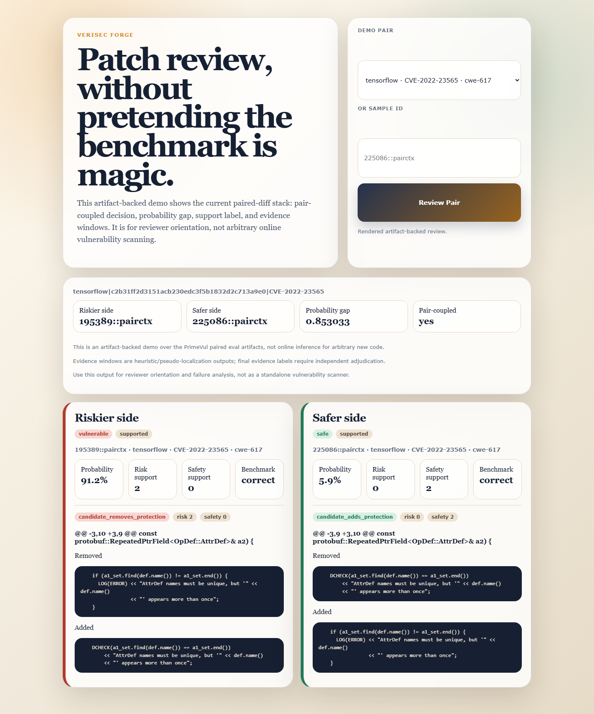

# VeriSec Forge

**Shortcut-aware secure patch reasoning with paired-diff evaluation, pair-coupled decoding, and evidence-coupled audit.**

VeriSec Forge is now pruned as a paper-facing research artifact. The repository is not trying to be a general secure-coding assistant or a catalog of every experiment run along the way. It presents one focused research story:

> Can secure-code models be stress-tested under paired vulnerable/fixed patch conditions, without letting shortcut artifacts, output-format noise, or unsupported rationales masquerade as security reasoning?

The project is aimed at the standard of top security/ML systems groups: clear problem framing, falsifiable controls, reproducible artifacts, and honest claim boundaries.



## Core Contributions

1. **Shortcut-aware benchmark diagnosis.** Same-source PrimeVul detection reaches high headline accuracy, but paired vulnerable/fixed controls expose artifact-sensitive behavior. Negative controls stay near chance: metadata-only `0.5022`, candidate-only `0.5078`, and counterpart-only `0.5156` balanced accuracy.

2. **Paired diff reasoning and task-structured decoding.** Diff-only paired training is the credible mainline, with three-seed mean balanced accuracy `0.8287`. Pair-coupled decoding is the strongest system layer: five-split mean balanced accuracy `0.8572`, with strict same-split pair-minus-bucket delta `+0.0348` BA and bootstrap 95% CI `[0.0329, 0.0368]`.

3. **Evidence-coupled audit loop.** Evidence localization is treated as a decision-coupled diagnostic, not as a solved explanation task. Side-correct rows reach top-1 localization `0.7610`, while side-wrong rows fall to `0.0632`, making error propagation measurable.

4. **Bounded external generalization.** CVE-disjoint, project-disjoint, time-disjoint, DeltaSecommits, and PatchEval checks support a narrow claim: source-aware paired-diff experts and learned closed-world routing improve robustness, but this is not open-set expert discovery.

## Headline Evidence

| Claim | Main Result | Where To Read |
| --- | ---: | --- |
| Artifact-sensitive same-source success needs controls | same-source accuracy `0.9524`; paired controls near chance | [PrimeVul Progressive Controls](reports/PRIMEVUL_PROGRESSIVE_CONTROLS.md) |
| Pair-coupled decoding is the strongest current layer | five-split mean BA `0.8572`; mean delta `+0.0348` | [Pair-Coupled Significance](reports/PRIMEVUL_PAIR_COUPLED_SIGNIFICANCE.md) |
| Learned joint side choice is promising but not yet strongest | held-out pair orientation `0.8283`; decoder reference `0.8572` | [Learned Joint Pairwise Baseline](reports/LEARNED_JOINT_PAIRWISE_BASELINE.md) |
| Low-margin abstention gives a stable review operating point | accepted accuracy `0.8767` at coverage `0.7896`; error capture `0.4087` | [Selective Calibration](reports/PRIMEVUL_JOINT_PAIRWISE_SELECTIVE_CALIBRATION.md) |
| Targeted adaptation can remove a measured shortcut | padding violation `0.4250 -> 0.1300`; paired `p<1.4e-23`; main-task delta not significant | [Nuisance Adaptation Pilot](reports/PRIMEVUL_NUISANCE_PAIRWISE_ADAPTATION_PILOT.md) |
| A larger frozen pair head does not solve the gap | hidden/score probes `0.6856` / `0.6941`; synthetic reverse exact match `1.21%` | [Learned Joint Pairwise Baseline](reports/LEARNED_JOINT_PAIRWISE_BASELINE.md) |
| Real-pair consistency helps, but synthetic supervision remains stronger | real-only `0.7219`; consistency `0.7437`; synthetic-supervised `0.8283` | [Joint Pairwise Baseline](reports/LEARNED_JOINT_PAIRWISE_BASELINE.md) |
| The synthetic-supervised model is also more stable in current stress tests | mean invariant change `0.2494` vs `0.2944` | [Joint Counterfactual Comparison](reports/PRIMEVUL_JOINT_COUNTERFACTUAL_COMPARISON.md) |
| Counterfactual interventions expose causal shortcut sensitivity | VeriPatch-RR v0.1 is tokenizer-neutral and separates relation tests from context pressure | [VeriPatch-RR v0.1](reports/RELATIONAL_BENCHMARK_V2.md) |
| Frozen-instrument smoke exposes relational failure | Qwen 1.5B representative base `0.6533`, robust `0.4883`, side-swap `0.4950` | [VeriPatch-RR Qwen Smoke](reports/VERIPATCH_RR_QWEN15B_SMOKE.md) |
| Mechanism audit separates context, endpoint, and representation effects | 1024 swap `0.4850`; suffix relation `0.4267` -> terminal phrase `0.9050`; Delta raw `0.4700` -> expanded `0.7500` | [Qwen Mechanism Audit](reports/QWEN_RELATIONAL_MECHANISM_AUDIT.md) |
| Cross-architecture controls separate two failure modes | exact-contract swap `0.4600/0.5300`; endpoint gap `+0.3767`, paired 95% CI `[0.3317, 0.4200]` | [Cross-Model Relational Audit](reports/CROSS_MODEL_RELATIONAL_AUDIT.md) |
| Same-backbone readout ablation isolates endpoint robustness | mean post-diff `0.8983`; changed-hunk `0.9983`; no readout passes the preregistered canonical-delta rule | [Readout Ablation](reports/READOUT_ABLATION.md) |
| Independent confirmation replicates the mechanism, not non-inferiority | suffix delta `+0.3095` mean / `+0.4903` changed-hunk; both canonical non-inferiority CIs fail | [Readout Confirmation](reports/READOUT_CONFIRMATORY.md) |
| Frozen-backbone control separates direct pooling from training effects | mean delta `+0.0260` (CI crosses 0); changed-hunk `+0.1970` (`95% CI [+0.1418, +0.2554]`) | [Frozen-Backbone Readout Control](reports/FROZEN_BACKBONE_READOUT_CONTROL.md) |
| Time/project/CVE stress tests preserve the mainline | time direct-train BA `0.8835`; composite BA `0.8853` | [Time-Disjoint Comparison](reports/PRIMEVUL_TIME_DISJOINT_COMPARISON.md) |
| Source-aware routing is useful but bounded | routed BA `0.8664`; closed-world delta `+0.0073` | [Learned Router Claim Boundary](reports/LEARNED_ROUTER_CLAIM_BOUNDARY.md) |
| Evidence quality depends on correct side choice | side-correct top-1 `0.7610`; side-wrong top-1 `0.0632` | [Predicted-Side Hunk Scorer](reports/PRIMEVUL_PREDICTED_SIDE_HUNK_SCORER.md) |

## Reading Order

Start with:

- [Paper 1 Abstract Draft](paper/abstract.md)
- [Paper 1 Outline](paper/outline.md)
- [Paper 1 Main Claims](paper/main_claims.md)
- [Paper 1 Main Results Table](paper/tables/main_results.md)
- [Application Packet](docs/APPLICATION_PACKET.md)
- [Application Focus](docs/APPLICATION_FOCUS.md)
- [Next Method Phase](docs/NEXT_METHOD_PHASE.md)
- [Relational Benchmark V2 Protocol](docs/COUNTERFACTUAL_SHORTCUT_PROTOCOL.md)
- [Project Story](PROJECT_STORY.md)
- [Results Index](reports/RESULTS_INDEX.md)
- [Reproducibility Guide](REPRODUCIBILITY.md)

Then inspect the artifact-backed demo:

- [Patch Review Demo](docs/PATCH_REVIEW_DEMO.md)
- [Patch Review Walkthrough](docs/PATCH_REVIEW_WALKTHROUGH.md)

## Repository Map

- `src/vrf/`: core library code for datasets, evaluation, routing, reporting, serving, and reproducibility helpers.
- `scripts/`: curated reproduction and report-building scripts for the retained research story.
- `reports/`: pruned result set; intermediate sweeps and obsolete branches were removed.
- `paper/`: paper-facing abstract, outline, claim hierarchy, tables, and editable SVG figures.
- `reproducibility/`: manifests and release metadata for local artifact validation and bundle packaging.
- `configs/`: only the patch-review demo config, the report index config, and the application summary config.
- `tests/`: focused tests for the retained core and application-facing scripts.

## Quick Verification

Linux/macOS:

```bash
python -m venv .venv
source .venv/bin/activate
python -m pip install -e ".[dev]"
python -m pytest -q
```

Windows PowerShell:

```powershell
python -m venv .venv
.\.venv\Scripts\Activate.ps1
python -m pip install -e .[dev]
.\.venv\Scripts\python.exe -m pytest -q
```

Build the reviewer-facing tokenizer-neutral benchmark:

```powershell
.\.venv\Scripts\python.exe scripts\build_relational_benchmark_v2.py
```

Materialize accounting for the exact model runtime before inference:

```powershell
.\.venv\Scripts\python.exe scripts\materialize_relational_runtime.py `
  --model-id <model-id> `
  --tokenizer <tokenizer-id-or-path> `
  --max-length 512 `
  --output data\processed\<model>-veripatch-rr-runtime.jsonl
```

VeriPatch-RR v0.1 contains a within-source representative,
source-macro-balanced primary suite and a separate marginal-balanced stress
suite over PrimeVul, DeltaSecommits, and PatchEval. It renders side swaps
through one canonical path, tracks changed-line occurrences through exact fast
tokenizer offsets, and computes truncation with each model's own tokenizer,
context length, truncation side, and special-token policy.

The first Qwen mechanism audit shows that increasing the context cap from
`512` to `1024` does not repair side-order equivariance. Semantically neutral
post-diff padding remains strongly directional without introducing critical
hunk truncation, while adding a terminal task-completion phrase largely
restores decision consistency. DeltaSecommits representation interventions
recover ordinary accuracy
but not swap or suffix robustness, separating representation recovery from
relational consistency.

The first encoder control sharpens that conclusion. A CodeBERT classifier
trained on the same 6,000 bidirectional side-choice rows reaches `0.5300`
exact-training-contract side-swap equivariance, versus Qwen's `0.4600`, but
preserves `0.9417` of canonical
decisions under post-diff padding. Relational inconsistency therefore appears
broader than one architecture, while the severe terminal endpoint effect is
not reproduced by this first-token encoder readout. The paired endpoint gap is
`+0.3767` with bootstrap 95% CI `[0.3317, 0.4200]`, and remains positive on
jointly clean, both-canonical-correct, and confidence-matched subsets.
Against marginal-conditioned independent-decision baselines, Qwen is nearly
independent (`+0.0064` canonical; `-0.0307` exact contract), while CodeBERT
shows limited but incomplete relational signal (`+0.0797`; `+0.0811`).

A preregistered same-backbone Qwen ablation then changes only hidden-state
readout. Mean pooling raises post-diff consistency from `0.5533` to `0.8983`;
changed-hunk pooling reaches `0.9983`. The latter still has only `0.5017`
side-swap equivariance against a `0.5002` marginal-conditioned baseline,
showing that endpoint robustness and side-order reasoning are separable.
First-token pooling collapses, as expected for a causal decoder whose first
token cannot see the later diff. No candidate meets the fixed
`|canonical delta| <= 0.02` success rule, so this remains a discovery-stage
mechanism result rather than a promoted model improvement.

An independent confirmation freezes PR #8 as discovery and evaluates 180 new
pair IDs, three unseen suffix templates, and seeds `7` and `123`. Mean pooling
improves visible-suffix consistency by `+0.3095` with 95% CI
`[+0.2348, +0.3799]`; changed-hunk pooling improves it by `+0.4903` with
95% CI `[+0.4448, +0.5357]`. Both effects are positive in both seeds, with
zero changed-hunk fallback. Neither candidate passes the preregistered
canonical non-inferiority criterion: pooled canonical deltas are `-0.0139`
and `-0.0250`, with lower confidence bounds below `-0.02`. The replicated
claim is therefore causal endpoint-robustness control, not a promoted
accuracy-preserving classifier. Side-swap equivariance remains near its
marginal-conditioned independence baseline.

A frozen-backbone matched-head control then holds the terminal-trained
Qwen+LoRA hidden states fixed. Mean pooling no longer has a stable suffix
advantage (`+0.0260`, 95% CI `[-0.0281, +0.0823]`), while changed-hunk
pooling retains a direct gain of `+0.1970` with 95% CI
`[+0.1418, +0.2554]`. This separates two mechanisms: mean pooling primarily
changes the fine-tuning trajectory, whereas changed-hunk pooling also
structurally excludes endpoint tokens. Canonical non-inferiority remains
unestablished, and side-order reasoning remains unresolved. The seeds in this
frozen-backbone control vary only the matched linear heads; all results are
conditional on one terminal-seed7 frozen Qwen+LoRA representation.

Validate local reproducibility inputs:

```powershell
.\.venv\Scripts\python.exe scripts\reproduce_primevul_calibrated_router.py --check-only
.\.venv\Scripts\python.exe scripts\reproduce_primevul_evidence_coupled.py --check-only
.\.venv\Scripts\python.exe scripts\build_reproducibility_bundle.py --manifest reproducibility\external_generalization_manifest.json --check-only --include-generated
.\.venv\Scripts\python.exe scripts\build_reproducibility_bundle.py --manifest reproducibility\readout_confirmatory_manifest.json --check-only --include-generated
.\.venv\Scripts\python.exe scripts\download_reproducibility_bundle.py --bundle-name readout_confirmatory_inputs --restore
```

Run the local patch-review UI:

```powershell
.\.venv\Scripts\python.exe -m vrf.cli serve --config configs\serve_patch_review_demo.json
```

Then open `http://127.0.0.1:8000/review-pair/ui`.

## What Was Pruned

The repository previously contained many historical branches: CodeXGLUE experiments, SFT/DPO/verifier dead ends, broad failure-analysis dumps, obsolete configs, generated egg-info metadata, and repeated side-inversion queue variants. Those were useful during exploration but weak for application review because they blurred the strongest research signal.

The retained repository emphasizes:

- paired patch/diff reasoning over generic vulnerability classification
- shortcut controls over raw leaderboard-style scores
- pair-coupled decoding over single-row prediction
- closed-world source-aware routing with explicit limitations
- evidence localization as diagnostic support, not an overclaimed explanation result

## Claim Boundaries

This project is a research artifact, not a deployed vulnerability scanner. The current evidence supports paired-diff reasoning and bounded source-aware routing under the materialized datasets and prediction artifacts. It does not claim open-set source discovery, human-gold evidence localization, or production-grade secure-code review.

The earlier regex identifier/formatting counterfactuals remain diagnostic
pilots, not validated semantics-preserving interventions. Reviewer-facing
counterfactual claims should use the v2 transformation tiers and report
context-pressure separately from no-truncation invariance.
