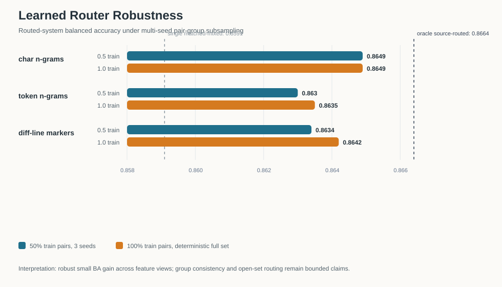

# VeriSec Forge Application Packet

> **CORRECTED — WITHDRAWN RESULTS.**
> This document previously presented PrimeVul detector results as evidence of learned
> secure-patch reasoning. That interpretation was withdrawn after adversarial
> structural-control analysis. Under the closed-world pair constraint the fine-tuned
> detector reaches balanced accuracy `0.8596`; a **semantics-free character-level diff
> structural control** reaches `0.8588` on the same evaluation population. The difference
> is `+0.0008`, with a pair-group clustered 95% CI spanning zero (`[-0.0202, +0.0222]`)
> and a non-significant group-level sign test (19 vs 18, `p=1.0`).
> **This experiment does not establish semantic secure-patch reasoning beyond diff structure.**
> Current status: [Result Status Ledger](RESULT_STATUS_LEDGER.md).

## What this project actually contributes

The project demonstrated that apparently strong vulnerability-detection performance can
collapse or be reproduced by structural shortcuts under stricter paired evaluation.
Adversarial controls showed that character-level diff structure nearly matched the
fine-tuned detector, preventing an unsupported semantic-learning claim.

Concretely:

- A same-source detector scoring `0.9524` falls to `0.4961` under paired evaluation.
- A semantics-free control reading only net added-minus-removed **characters** reaches
  `0.8627` unconstrained — above the fine-tuned detector's `0.8136` — and `0.8588` under
  the pair constraint against the detector's `0.8596`.
- The detector is `0.2584` accurate on rows where that control errs, i.e. below chance:
  it follows the structural shortcut into its errors rather than correcting them.
- Two circular evaluations were identified and withdrawn: an evidence metric whose target
  was derived from the decision it was meant to validate, and a human-confirmation step
  anchored to the pipeline's own proposals.

The contribution is the identification and measurement of shortcut-driven performance,
not a successful semantic vulnerability detector.

## Positioning

**Trustworthy evaluation and evidence-grounded reasoning for secure patch understanding.**

VeriSec Forge studies why vulnerability-detection scores can look strong under shortcut-prone benchmark splits, then rebuilds the task around paired vulnerable/fixed code diffs, negative controls, pair-coupled decoding, source-aware routing, evidence triage, and public bundle-assisted reproducibility.

The project is a defensive security-analysis research system, not an exploit-generation tool and not a general-purpose vulnerability scanner.

## Three Contributions

### 1. Shortcut-Aware Benchmark Diagnosis

A same-source PrimeVul detector reaches `0.9524` accuracy, but paired vulnerable/fixed stress testing shows that this high score is artifact-sensitive rather than a robust semantic detection breakthrough. Negative controls stay near chance, including metadata-only `0.5022`, candidate-only `0.5078`, and counterpart-only `0.5156` balanced accuracy.

### 2. Paired Diff Reasoning And Pair-Coupled Decoding

**WITHDRAWN — historical figures below.** Corrected: under the closed-world pair constraint the detector reaches BA `0.8596` and a semantics-free character-level diff control reaches `0.8588` on the same population (difference `+0.0008`, clustered 95% CI `[-0.0202, +0.0222]`, sign test 19 vs 18, `p=1.0`). **No semantic advantage beyond diff structure was established.** Historical text: After removing obvious shortcuts, paired diffs still carry learnable security signal. Diff-only paired training reaches three-seed mean balanced accuracy `0.8287`, and no-metadata diff evaluation remains strong at `0.8244`. Pair-coupled decoding uses the vulnerable/fixed pair structure directly and improves five-split mean balanced accuracy to `0.8572`, with strict pair-minus-bucket BA delta `+0.0348` and bootstrap 95% CI `[0.0329, 0.0368]`.

### 3. External Source-Aware Stress And Evidence-Coupled Audit Loop

The paired-diff stack now has external stress coverage across PrimeVul time-disjoint, DeltaSecommits, and PatchEval. A three-source source-routed expert mixture improves aggregate BA from `0.8591` to `0.8664`; learned diff-body-only routing reaches row routing accuracy `0.9063` and end-to-end routed BA `0.8664`. The claim remains deliberately bounded as closed-world source-aware expert selection, not open-set source discovery.

**WITHDRAWN — circular metric.** The evidence contrast was computed from the same side decision it was meant to validate, and the human-confirmation step only ever confirmed pipeline-proposed windows, so it cannot measure missed evidence. Not localization accuracy, not human-validated. Historical figures below. Historical text: Evidence localization is treated as failure triage rather than gold-span proof. Side-correct rows reach top-1 localization `0.7610`, while side-wrong rows fall to `0.0632`, showing that evidence quality is coupled to upstream pair-side decisions.

## Reproducibility And Demo

- PrimeVul router/evidence-coupled public bundle: `reproducibility/release_artifacts.json`
- External-generalization/source-routing public bundle v10: `external-generalization-bundle-v10`
- Current external bundle SHA256: `90dbaaf40665494b2b1fa62781c3e09d7ec59ed3cf3611e76b9b61a27ae3465c`
- Patch review walkthrough: `docs/PATCH_REVIEW_DEMO.md`
- Fixed restored-example walkthrough: `docs/PATCH_REVIEW_WALKTHROUGH.md`
- Final submission statistics: `reports/FINAL_SUBMISSION_STATISTICS.md`
- Full research narrative: `PROJECT_STORY.md`

## Claim Boundary

- Do not present the same-source `0.9524` result as the main achievement; it is the artifact diagnosis that motivates stricter evaluation.
- Do not present pseudo-label evidence localization or AI-filled adjudication as independent human gold.
- Do not present source routing as open-set expert discovery; current evidence supports closed-world source-aware expert selection.
- Do not present the demo as arbitrary online vulnerability scanning; it is an artifact-backed reviewer walkthrough over reproduced examples.

## Best Framing For PhD Applications

VeriSec Forge shows research maturity through the full loop: discovering benchmark shortcuts, designing stricter paired-diff evaluation, adding task-structured decoding, stress-testing external sources, bounding claims with negative controls and statistics, and making the audit trail reproducible.
