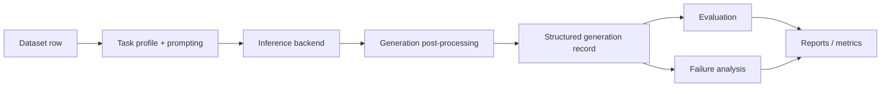

# Architecture Overview

This document explains how `VeriSec Forge` is organized today, after the repo-health refactors that split parsing, prompting, generation, experiment summaries, and run orchestration into clearer layers.

## Design Goals

The repository is optimized for three things at once:

- reproducible secure-code experiments
- structured outputs that can be parsed and scored automatically
- enough modularity that new benchmark lines do not require editing every core file

The codebase is intentionally research-oriented, so some modules are designed around experiment velocity. The goal of the current layout is not to eliminate all coupling, but to keep the coupling visible and manageable.

## Core Package Layout

### Runtime and I/O

- [D:\code\start\src\vrf\io_utils.py](D:/code/start/src/vrf/io_utils.py)
  Shared JSON/JSONL read-write helpers.

- [D:\code\start\src\vrf\schemas.py](D:/code/start/src/vrf/schemas.py)
  Canonical dataclasses for samples, structured generations, evidence spans, and experiment records.

- [D:\code\start\src\vrf\tracking.py](D:/code/start/src/vrf/tracking.py)
  Experiment tracker logging.

### Prompting and Generation

- [D:\code\start\src\vrf\task_profiles.py](D:/code/start/src/vrf/task_profiles.py)
  Task-level system prompts and secure-code task profiles.

- [D:\code\start\src\vrf\prompting.py](D:/code/start/src/vrf/prompting.py)
  Prompt compression, long-code windowing, and prompt shaping helpers.

- [D:\code\start\src\vrf\text_utils.py](D:/code/start/src/vrf/text_utils.py)
  Structured parsing, tolerant JSON-ish parsing, CWE normalization, and text cleanup logic.

- [D:\code\start\src\vrf\generation.py](D:/code/start/src/vrf/generation.py)
  Secure-code generation post-processing, second-pass handling, verifier hooks, and record construction.

- [D:\code\start\src\vrf\inference.py](D:/code/start/src/vrf/inference.py)
  Backend loading, model invocation, batch generation coordination, and top-level inference orchestration.

### Evaluation and Analysis

- [D:\code\start\src\vrf\evaluation.py](D:/code/start/src/vrf/evaluation.py)
  Row-level secure-code evaluation and metric aggregation.

- [D:\code\start\src\vrf\analysis.py](D:/code/start/src/vrf/analysis.py)
  Failure taxonomy, error-bucket analysis, and benchmark summaries.

- [D:\code\start\src\vrf\research_summary.py](D:/code/start/src/vrf/research_summary.py)
  Shared logic for summary documents and curated experiment comparisons.

- [D:\code\start\src\vrf\report_index.py](D:/code/start/src/vrf/report_index.py)
  Manifest-driven results index generation.

### Experiment Orchestration

- [D:\code\start\src\vrf\run_specs.py](D:/code/start/src/vrf/run_specs.py)
  Shared run-artifact specs used to materialize evaluation and analysis configs.

- [D:\code\start\src\vrf\pipelines.py](D:/code/start/src/vrf/pipelines.py)
  End-to-end pipeline entrypoints for baseline, evaluate, and analyze flows.

- [D:\code\start\src\vrf\cli.py](D:/code/start/src/vrf/cli.py)
  User-facing CLI command dispatch.

- [D:\code\start\src\vrf\serving.py](D:/code/start/src/vrf/serving.py)
  FastAPI serving wrapper around the same generation stack.

### Training

- [D:\code\start\src\vrf\training_common.py](D:/code/start/src/vrf/training_common.py)
  Shared training helpers: config loading, tokenizer/model source resolution, prompt rendering, and tracker logging.

- [D:\code\start\src\vrf\training_sft.py](D:/code/start/src/vrf/training_sft.py)
- [D:\code\start\src\vrf\training_dpo.py](D:/code/start/src/vrf/training_dpo.py)
- [D:\code\start\src\vrf\training_reward.py](D:/code/start/src/vrf/training_reward.py)
- [D:\code\start\src\vrf\training_grpo.py](D:/code/start/src/vrf/training_grpo.py)

These files still represent distinct research stages, but they now share a more consistent tokenizer/prompt/bootstrap layer through `training_common.py`.

## Main Data Flow

### In practice

1. A sample is loaded from JSONL.
2. Prompt construction and compression happen in `prompting.py`.
3. A backend in `inference.py` generates raw text.
4. `generation.py` converts raw text into a normalized `SecureCodeGenerationRecord`.
5. `evaluation.py` and `analysis.py` operate on the same normalized record shape.

That last point matters: one of the repo-health fixes was to stop `evaluation` and `analysis` from silently loading records differently.

## Why Some Modules Were Split

The original repository moved fast by letting a few files do too much. That helped during exploration, but it became harder to safely extend.

The major refactor decisions were:

- move prompt compression out of `inference.py`
- move generation-record construction out of `inference.py`
- centralize run-artifact specs instead of hardcoding more report triplets
- centralize training tokenizer/prompt helpers to reduce training-stage drift

The result is not “microservices in a repo”; it is a smaller set of clearer seams for a research codebase.

## Current Stability Guarantees

The repo now has lightweight protection over:

- default pytest discovery
- CLI dispatch
- serving smoke flows
- run-spec materialization
- report index generation
- training common helpers
- structured parsing and evaluation

See [D:\code\start\tests](D:/code/start/tests) for the current smoke and unit coverage.

## Known Remaining Debt

The repository is healthier than before, but a few structural debts still remain:

- [D:\code\start\src\vrf\inference.py](D:/code/start/src/vrf/inference.py) is still one of the larger coordination modules.
- Many experiment scripts still exist as one-off entrypoints even though they now share better infrastructure.
- Report assets are easier to navigate, but the results surface is still broad because the project intentionally preserves negative-result branches.

These are acceptable for the current stage, but they are the next places to keep pruning if the repo continues to grow.
