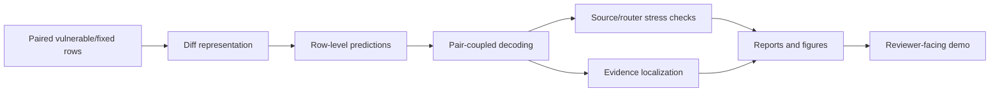

# Architecture Overview

VeriSec Forge is organized as a research artifact around paired secure-patch reasoning. The codebase keeps enough infrastructure to reproduce reports, run the artifact-backed demo, and extend the retained experiments without reviving the old config explosion.

## Main Layers

### Core Library

- `src/vrf/io_utils.py`: JSON/JSONL helpers.
- `src/vrf/schemas.py`: common data records for samples, generations, evidence, and experiment outputs.
- `src/vrf/text_utils.py`: tolerant parsing and text normalization.
- `src/vrf/evaluation.py`: metric aggregation and secure-code evaluation helpers.
- `src/vrf/report_index.py`: manifest-driven report index rendering.
- `src/vrf/reproducibility.py`: artifact hash validation and bundle packaging.

### Serving And Demo

- `src/vrf/serving.py`: FastAPI app and patch-review routes.
- `src/vrf/cli.py`: command dispatch, including `serve`.
- `configs/serve_patch_review_demo.json`: demo configuration.
- `docs/PATCH_REVIEW_DEMO.md`: reviewer workflow.
- `docs/PATCH_REVIEW_WALKTHROUGH.md`: fixed restored-example walkthrough.

### Report Scripts

The retained `scripts/` directory contains report builders, source-routing evaluators, evidence-coupled audit scripts, and reproducibility utilities. It intentionally no longer contains broad historical download/training/config-materialization branches.

### Reproducibility

- `reproducibility/primevul_calibrated_router_manifest.json`
- `reproducibility/primevul_evidence_coupled_manifest.json`
- `reproducibility/external_generalization_manifest.json`
- `scripts/build_reproducibility_bundle.py`
- `scripts/download_reproducibility_bundle.py`
- `scripts/restore_reproducibility_bundle.py`

These manifests record local paths, roles, byte sizes, row counts, SHA256 hashes, and expected metrics for the retained artifact chains.

## Data Flow

```mermaid
flowchart LR
  A["Paired vulnerable/fixed rows"] --> B["Diff representation"]
  B --> C["Row-level predictions"]
  C --> D["Pair-coupled decoding"]
  D --> E["Source/router stress checks"]
  D --> F["Evidence localization"]
  E --> G["Reports and figures"]
  F --> G
  G --> H["Reviewer-facing demo"]
```

## What Changed After Pruning

- The repository no longer presents itself as a broad post-training workbench.
- Old CodeXGLUE, generic SFT/DPO, verifier, and failure-dump branches were removed.
- The visible reports are now a curated evidence set for the paired-diff research claim.
- Generated package metadata is ignored.
- The remaining configs are application-facing rather than experiment-matrix-facing.

## Extension Rule

New code should serve one of three purposes:

- strengthen paired-diff evaluation or pair-coupled decoding
- test bounded external/source-routing generalization
- improve evidence-coupled audit with clearer adjudication

Everything else belongs in a scratch branch, not the application artifact.
