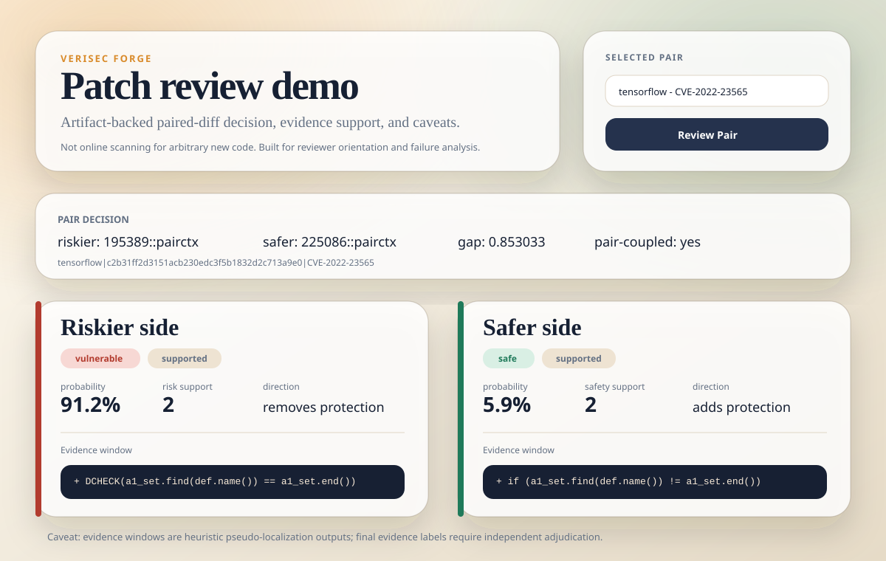

# Patch Review Demo

This demo exposes the current PrimeVul paired-diff research stack as a lightweight reviewer-facing CLI.

It is intentionally artifact-backed: it reads the paired eval dataset, pair-coupled predictions, and evidence-localization outputs already produced by the reproducible PrimeVul chain. It does not run a model checkpoint and it should not be described as an online vulnerability scanner for arbitrary new code.



## List Demo Pairs

```powershell
.\.venv\Scripts\python.exe -m vrf.cli patch-demo --list-examples 5
```

## Review One Pair

```powershell
.\.venv\Scripts\python.exe -m vrf.cli patch-demo --id 225086::pairctx
```

You can also select by pair key:

```powershell
.\.venv\Scripts\python.exe -m vrf.cli patch-demo --pair-key "tensorflow|c2b31ff2d3151acb230edc3f5b1832d2c713a9e0|CVE-2022-23565"
```

## API Mode

The FastAPI service also exposes the same artifact-backed review path:

```powershell
.\.venv\Scripts\python.exe -m vrf.cli serve --config configs/serve_patch_review_demo.json
```

Then call:

```powershell
Invoke-RestMethod -Method Get "http://127.0.0.1:8000/review-pair/examples?limit=5"
Invoke-RestMethod -Method Post "http://127.0.0.1:8000/review-pair" `
  -ContentType "application/json" `
  -Body '{"sample_id":"225086::pairctx","evidence_limit":1}'
```

For a browser-friendly walkthrough, open:

```text
http://127.0.0.1:8000/review-pair/ui
```

## Output Contract

The command returns JSON with:

- `pair_decision`: riskier side, safer side, probability gap, and whether pair-coupled decoding was applied.
- `rows`: per-side decision, benchmark gold label, probability, support label, risk/safety support scores, and top evidence windows.
- `caveats`: explicit research boundaries for reviewer-facing use.

## Interpretation

Use this demo for orientation, failure analysis, and application walkthroughs. Evidence windows are heuristic/pseudo-localization artifacts; final evidence labels require independent adjudication through the manual evidence workflow.
