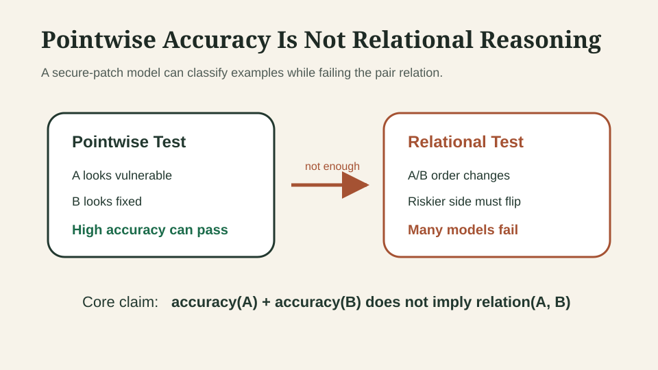
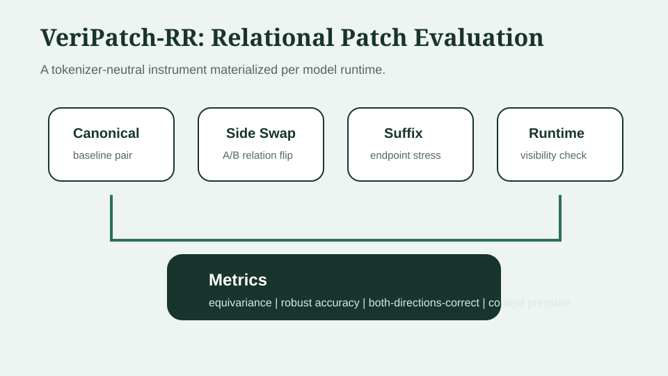
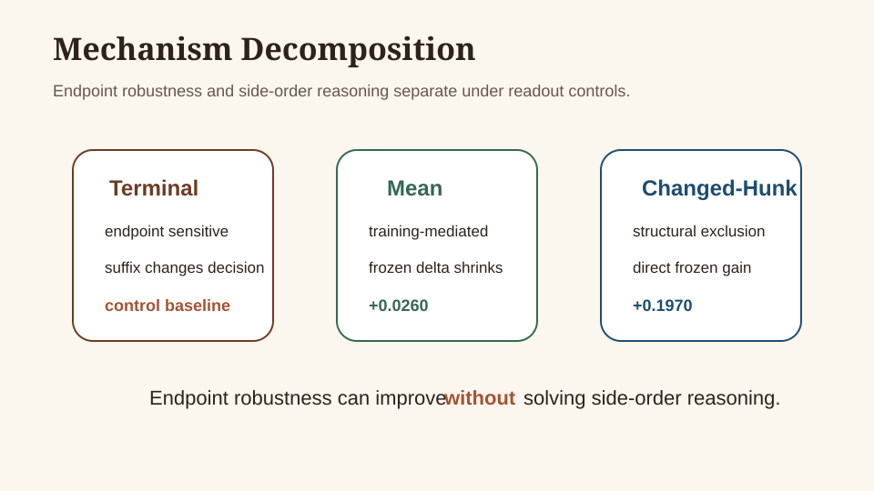
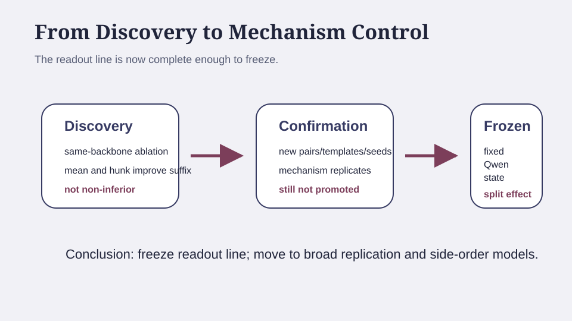

# Pointwise Accuracy Is Not Relational Reasoning

## Abstract

Secure-code models are usually evaluated pointwise, but patch review is
relational: a model should identify which side of a vulnerable/fixed pair is
riskier and preserve that relation under side swaps and irrelevant context
changes. We introduce VeriPatch-RR, a tokenizer-aware relational evaluation
instrument that measures side-order equivariance, endpoint robustness,
both-directions-correct behavior, and runtime evidence visibility. Across
decoder, encoder, and generative settings, we find that pointwise competence
does not imply relational consistency; endpoint robustness is readout
controllable in Qwen, but side-order reasoning remains unresolved. These
results argue that secure-patch evaluation should report relational consistency
rather than relying on pointwise accuracy alone.

## 1. Introduction

Security patch review is inherently comparative. A reviewer often asks which
side of a vulnerable/fixed pair carries the risk, what code evidence supports
that decision, and whether the answer would remain stable if the vulnerable and
fixed sides were presented in the opposite order. Standard secure-code model
benchmarks rarely test this relation directly. They usually ask whether a
single function, commit, or snippet is vulnerable. That pointwise framing is
useful, but it can overstate what a model has learned.

This paper studies the gap between pointwise secure-code accuracy and
relational patch understanding. The central observation is simple: a model can
look competent on individual examples while behaving like two nearly
independent classifiers when the sides of a patch pair are swapped. If Side A
is vulnerable in the canonical rendering, then after an exact A/B swap the
riskier side should also swap. A model that fails this test is not merely
making an ordinary classification error; it is failing a structural property
of the task.

We ask: when a secure-code model is given two sides of the same patch, does it
represent the relation between them, or does it behave like an independent
pointwise classifier applied twice?



**Figure 1.** Pointwise accuracy can look strong while leaving the paired
vulnerable/fixed relation untested. VeriPatch-RR evaluates whether decisions
preserve known relations under side swaps and suffix perturbations. This
motivates relational evaluation; it does not by itself claim a new
vulnerability detector.

This paper makes four contributions.

1. We introduce VeriPatch-RR, a tokenizer-aware relational evaluation
   instrument for paired secure-patch examples.
2. We show that pointwise competence does not imply side-order consistency
   across a Qwen decoder classifier and a CodeBERT encoder classifier.
3. We show that endpoint robustness is readout-controllable in Qwen, but
   separable from side-order reasoning.
4. We provide a bounded model-family stress replication with a non-Qwen decoder
   classifier and a generative no-classification-head judge, while explicitly
   limiting broad universal claims because both added slots have low canonical
   accuracy.

The intended contribution is not a new vulnerability scanner. It is a
measurement and mechanism study: VeriPatch-RR shows how secure-patch models can
fail under relation-preserving transformations, and why evaluation should
measure those failures directly.

## 2. Related Work and Positioning

### 2.1 Secure-Code Vulnerability and Patch Benchmarks

Prior vulnerability and code benchmarks provide the data foundation for
secure-code evaluation, including vulnerability-focused datasets such as
PrimeVul and DiverseVul and broader code intelligence benchmarks such as
CodeXGLUE [RELATED: primevul; diversevul; codexglue]. VeriPatch-RR differs by
treating vulnerable/fixed patch review as a relational task rather than only a
pointwise vulnerability label.

### 2.2 Code Model Evaluation Beyond Pointwise Accuracy

Pretrained code models such as CodeBERT and benchmark suites such as
CodeXGLUE have shaped how code understanding systems are evaluated
[RELATED: codebert; codexglue]. This paper does not propose a new general code
model benchmark; it asks whether secure-patch decisions remain structurally
consistent under transformations whose expected relation is known before
evaluation.

### 2.3 Robustness, Counterfactual, and Consistency Evaluation

VeriPatch-RR is closest in spirit to behavioral and counterfactual evaluation:
transformations are useful only when the expected relation is specified before
evaluation [RELATED: checklist; counterfactual-augmentation]. Unlike generic
robustness tests, VeriPatch-RR separates identity tests, side-swap
equivariance, and visibility-qualified context pressure.

### 2.4 Evidence Localization and Explanation Faithfulness

Evidence localization in this project is treated as an audit diagnostic rather
than a solved explanation task. This is consistent with broader work on
rationale evaluation and explanation faithfulness, where human-aligned
rationales and faithful causal explanations are distinct requirements
[RELATED: eraser; attention-not-explanation; attention-not-not-explanation].

### 2.5 Positioning

This paper differs from standard vulnerability detection work by treating
vulnerable/fixed patch review as a relational task. It separates side-order
equivariance from endpoint robustness and runtime visibility, then uses that
separation to distinguish model-family stress failures from readout-specific
mechanisms.

## 3. Problem Formulation

We consider a paired patch input `x = (A, B)`, where `A` and `B` are two
rendered sides of a vulnerable/fixed pair. The gold label `y` belongs to
`{A, B}` and identifies the riskier side. A model `f` outputs either a forced
decision in `{A, B}` or, in some settings, an abstention such as
`INSUFFICIENT_CONTEXT`.

Let `T_swap(x) = (B, A)` be the side-swap transformation, and let
`T_swap(y)` be the corresponding swapped gold label. A side-order consistent
model should satisfy:

```text
f(T_swap(x)) = T_swap(f(x))
```

Pointwise accuracy measures whether the model selects the gold riskier side
for a single rendering. This is the conventional metric, but it does not test
whether the model represents the relation between the two sides.

Side-order equivariance measures whether the model flips its decision when the
two sides are swapped. If a canonical rendering has gold label `A`, the swapped
rendering should have gold label `B`. A model succeeds only if its predictions
change accordingly.

The marginal-conditioned independence baseline controls for label bias. A
model that predicts `A` or `B` with skewed marginal probabilities can achieve
nonzero flip rates by chance. We therefore compare observed side-swap
equivariance against the flip rate expected from independent canonical and
swapped decisions with the same marginal `B` rates.

Both-directions-correct is stricter than swap equivariance. It requires the
canonical prediction and the swapped prediction to both be correct. This metric
distinguishes structural flipping from reliable task performance.

Endpoint robustness measures whether a model preserves its decision under
semantically irrelevant text appended after the diff. This isolates terminal
context sensitivity from side-order reasoning.

Runtime visibility records whether the changed hunk remains visible under each
model's tokenizer, context length, truncation side, and special-token policy.
This is necessary because a transformation can change tokenization and
therefore hide the evidence a model would need.

## 4. VeriPatch-RR

VeriPatch-RR is a paired vulnerable/fixed patch benchmark built from PrimeVul,
DeltaSecommits, and PatchEval. It contains a representative suite and a
separate balanced-stress suite. The representative suite is the primary
paper-facing result; selected reports use a representative-core filtered
runtime containing canonical, side-swap, and suffix rows.



**Figure 2.** VeriPatch-RR separates canonical accuracy, side-swap
equivariance, suffix consistency, both-directions-correct behavior, and
runtime visibility. Transformations are interpreted only when their expected
relation is specified before evaluation. Context-pressure results remain
visibility-qualified and model-tokenizer specific.

Each example is rendered as a comparison between Side A and Side B. The main
transformations are:

- canonical pair rendering;
- canonical side swap;
- suffix and endpoint perturbations;
- context-pressure variants that place irrelevant text before or after the
  diff;
- metadata and nuisance interventions used for shortcut diagnosis.

We treat transformations as relation tests only when their expected relation is
specified before evaluation: identity for suffix perturbations, equivariant
swap for side swaps, and visibility-qualified comparisons for context-pressure
transformations.

Before inference, VeriPatch-RR materializes model-specific runtime accounting.
This step records token counts, truncation, changed-line visibility, and
whether a transformation introduced critical-hunk truncation. The same text can
have different visibility properties for Qwen, CodeBERT, distilgpt2, or a
generative instruction model, so visibility is part of the experimental
artifact rather than a post hoc explanation.

The evaluator reports relation metrics separately from ordinary accuracy. For
side swaps, it reports observed equivariance, marginal-conditioned independence
baselines, residuals, and both-directions-correct. For endpoint perturbations,
it reports suffix consistency and suffix robust accuracy. This separation is
important because a model can be stable and wrong.

## 5. Benchmark Diagnosis

A standard same-source vulnerability detector can appear strong while leaving
the relational question unanswered. In our initial PrimeVul same-source
setting, a detector reached `0.9524` accuracy
[RESULT: primevul-progressive-controls]. That score is useful as a diagnostic,
but it is not sufficient evidence of secure patch understanding.

[Table 1: Main Results Summary](tables/main_results.md)

**Table 1.** Main paper-facing results and their claim boundaries. The table
separates task-structured decision performance, relational failures, readout
mechanism evidence, and frozen-backbone controls. Readout rows are mechanism
evidence and do not establish canonical non-inferiority.

Paired controls reveal why. Metadata-only balanced accuracy was `0.5022`,
candidate-only was `0.5078`, and counterpart-only was `0.5156`
[RESULT: primevul-progressive-controls]. These near-chance controls protect the
claim that the diff-based paired task contains real relational signal rather
than only project, length, or source artifacts.

A diff-only paired detector achieved a three-seed mean balanced accuracy of
`0.8287` [RESULT: primevul-main-results]. Pair-coupled decoding further
improved the strongest system layer to five-split balanced accuracy `0.8572`,
with mean pair-minus-bucket delta `+0.0348`
[RESULT: pair-coupled-significance]. This is a useful task-structured system
result, but it is not the central claim of this paper. The central claim is
that paired evaluation changes what we can see: it exposes relation failures
that pointwise scores hide.

## 6. Cross-Model Relational Audit

We next ask whether relational failures are specific to the original Qwen
decoder classifier. We separate this section into a stronger
competency-controlled architecture comparison and a weaker but useful
low-canonical stress replication.

### 6.1 Competency-Controlled Architecture Comparison

The first cross-architecture audit compares a Qwen decoder classifier with a
CodeBERT encoder classifier under the fixed VeriPatch-RR protocol. Under
exact-training-contract side swaps, Qwen reaches `0.4600` and CodeBERT reaches
`0.5300` [RESULT: cross-model-relational-audit]. Both are incomplete, and both
must be interpreted against their marginal-conditioned independence baselines
rather than against a naive `0.5` chance line. The result shows that side-order
inconsistency is not simply a prompt wording artifact.

Endpoint behavior differs sharply. CodeBERT preserves post-diff decisions at
`0.9417`, while Qwen falls to `0.5650`, producing an endpoint gap of `+0.3767`
with paired bootstrap 95% CI `[0.3317, 0.4200]`
[RESULT: cross-model-relational-audit]. The gap remains positive on jointly
clean, both-canonical-correct, and confidence-near-matched subsets. This
decomposes two failure modes: side-order relational inconsistency appears in
both architectures, while severe terminal endpoint collapse is architecture
dependent.

### 6.2 Low-Canonical Stress Replication

PR #12 adds minimal broad replication without turning the study into a model
zoo. The added non-Qwen decoder classifier uses distilgpt2 with a LoRA
sequence-classification head. It reaches canonical accuracy `55.83%`, side-swap
equivariance `9.83%`, marginal-conditioned independence baseline `43.93%`, and
side-swap residual `-0.3410`; both-directions-correct is `6.67%`
[RESULT: cross-model-replication]. This is stress evidence, not a strong-model
result, because canonical accuracy is low.

The generative instruction judge uses strict outputs `A_RISKIER`, `B_RISKIER`,
or `INSUFFICIENT_CONTEXT`. It reaches canonical accuracy `46.67%`,
both-directions-correct `0.50%`, and invalid output rate `5.00%`
[RESULT: cross-model-replication]. Its prediction distribution is strongly
A-biased (`A=1620`, `B=90`, `INVALID=90`), so its suffix consistency should be
interpreted as decision stability rather than correct relational reasoning.

Together, these results support a bounded generality claim: side-order
relational failure is not confined to the original Qwen classifier. VeriPatch-RR
exposes similar stress failures across multiple mechanisms, including an
encoder classifier, a non-Qwen decoder classifier, and a generative
no-classification-head judge. The evidence does not prove that all strong
secure-code models fail.

## 7. Readout Mechanism

Having separated side-order failure from endpoint collapse, we study whether
Qwen's terminal endpoint sensitivity is caused by readout design. The
same-backbone ablation changes only how the hidden representation is read for
classification. Variants include terminal non-padding token readout,
first-token readout, mean pooling, changed-hunk pooling, and fixed terminal
anchor pooling.



**Figure 3.** Same-backbone readout ablations show that endpoint robustness can
be controlled by readout-conditioned training. Mean and changed-hunk pooling
improve suffix consistency, but no readout variant is promoted as an
accuracy-preserving better classifier. This figure supports mechanism control,
not model improvement.

### 7.1 Discovery: Readout-Conditioned Endpoint Robustness

Mean pooling raises post-diff consistency from `0.5533` to `0.8983`.
Changed-hunk pooling reaches `0.9983` [RESULT: readout-ablation]. However,
neither variant establishes canonical non-inferiority under the preregistered
success rule. The mechanism result is therefore not that these are better
classifiers, but that endpoint robustness is causally controllable by
readout-conditioned training.

### 7.2 Confirmation: New Pairs, Templates, and Seeds

An independent confirmation freezes the discovery setting and evaluates 180 new
pair IDs, three unseen suffix templates, and seeds `7` and `123`. Mean pooling
improves visible-suffix consistency by `+0.3095` with 95% CI
`[+0.2348, +0.3799]`. Changed-hunk pooling improves it by `+0.4903` with 95%
CI `[+0.4448, +0.5357]` [RESULT: readout-confirmation]. Both effects are
positive across the two seeds, and changed-hunk fallback is zero. Yet both fail
the canonical non-inferiority criterion, so the confirmed claim remains
mechanism control rather than promoted model improvement.



**Figure 4.** Independent confirmation and frozen-backbone controls separate
training-mediated and direct pooling effects. Mean pooling's benefit is mainly
training-mediated, while changed-hunk pooling retains a direct structural
effect under one fixed Qwen+LoRA representation. These results do not solve
side-order reasoning.

### 7.3 Frozen Representation Control: Direct vs Training-Mediated Effects

A frozen-backbone matched-head control separates representation effects from
pooling effects. Mean pooling's direct suffix benefit shrinks to `+0.0260`
with a CI crossing zero. Changed-hunk pooling retains a direct gain of
`+0.1970`, with 95% CI `[+0.1418, +0.2554]`
[RESULT: frozen-backbone-control]. This suggests that mean pooling's benefit
is mainly training mediated, while changed-hunk pooling has a more direct
structural effect over the fixed representation.

### 7.4 Separation From Side-Order Reasoning

Endpoint robustness does not solve side-order reasoning. Changed-hunk pooling
can nearly eliminate suffix instability while leaving side-swap behavior near a
marginal-conditioned independence baseline [RESULT: readout-ablation]. This is
the core mechanism conclusion: endpoint robustness and relational reasoning are
different capabilities.

## 8. Limitations

This work is a measurement study, not a deployed vulnerability scanner. The
artifact should not be used as an automated security review system without
human oversight.

The benchmark relies on existing vulnerable/fixed labels and does not yet
replace them with independent human adjudication. Label validity and
explanation validity are separate limitations: a pair can have the correct
side label while still lacking a human-verified minimal evidence span.

The broad model-family claim is intentionally limited. The strongest
competency-controlled comparison is between the Qwen decoder classifier and the
CodeBERT encoder classifier. The PR #12 distilgpt2 and generative-judge slots
broaden mechanism coverage, but both have low canonical accuracy and should be
treated as stress evidence rather than strong-model universal failure proof.

The generative judge is evaluated under a strict fixed-output protocol. This
avoids prompt search and manual repair, but it may understate models that
require more interactive or chain-of-thought-style prompting.

Readout variants are mechanism evidence, not promoted classifiers. None of the
readout candidates satisfies the preregistered canonical non-inferiority rule.

Bootstrap intervals are conditional on the selected experiment designs, seeds,
and frozen splits. They quantify uncertainty for the stated protocol, not for
all possible secure-code datasets or model families.

Runtime visibility is model-tokenizer specific. Critical-hunk truncation can
weaken direct comparability across architectures and must be reported alongside
relation metrics.

Evidence localization remains diagnostic unless independently human
adjudicated. The current evidence-coupled audit loop is useful for failure
analysis, but it is not yet a gold explanation benchmark.

## 9. Discussion

The main lesson is that secure-patch evaluation should measure relational
consistency, not only pointwise correctness. A model that classifies the
canonical rendering correctly can still fail the structural requirement that
the answer should flip under an A/B side swap. A model that is stable under a
suffix perturbation can still be stably wrong. These are not edge cases; they
are central to whether a model understands patch relations.

VeriPatch-RR is designed to make these distinctions visible. It separates
ordinary accuracy, side-order equivariance, marginal-conditioned independence,
both-directions-correct behavior, endpoint robustness, and runtime visibility.
This decomposition turns a vague complaint that "models are brittle" into
measurable failure modes.

The next method question is not another endpoint readout tweak. The unresolved
capability is side-order structure. Future systems should directly model the
antisymmetry of paired patch decisions, for example through joint A/B scoring,
swap-consistency losses, structured pair decoders, or objectives that optimize
both-directions-correct behavior.

The paper's practical recommendation is modest but important: when evaluating
secure-code models for patch review, include relation-preserving
transformations. If a model cannot preserve the relation between vulnerable and
fixed sides, then pointwise accuracy alone is not enough evidence of secure
patch understanding.

## Appendix Placeholders

### A. Artifact Manifest

[APPENDIX PLACEHOLDER: reproducibility bundle contents, report paths, and public
artifact hashes.]

### B. Bootstrap and Significance Protocol

[APPENDIX PLACEHOLDER: pair-cluster bootstrap, McNemar tests, split seeds, and
selection rules.]

### C. Runtime Visibility Schema

[APPENDIX PLACEHOLDER: tokenizer-specific accounting fields, critical-hunk
visibility, truncation flags, and transformation visibility.]

### D. Prompt and Output Contracts

[APPENDIX PLACEHOLDER: exact-training-contract prompts, generative judge fixed
output protocol, and invalid-output handling.]

### E. Result Anchor Map

The Markdown draft uses `[RESULT: ...]` anchors as an internal citation bridge.
The complete mapping from result anchors to repository reports, supporting
artifacts, and future paper tables is maintained in
[`result_anchor_map.md`](result_anchor_map.md).
