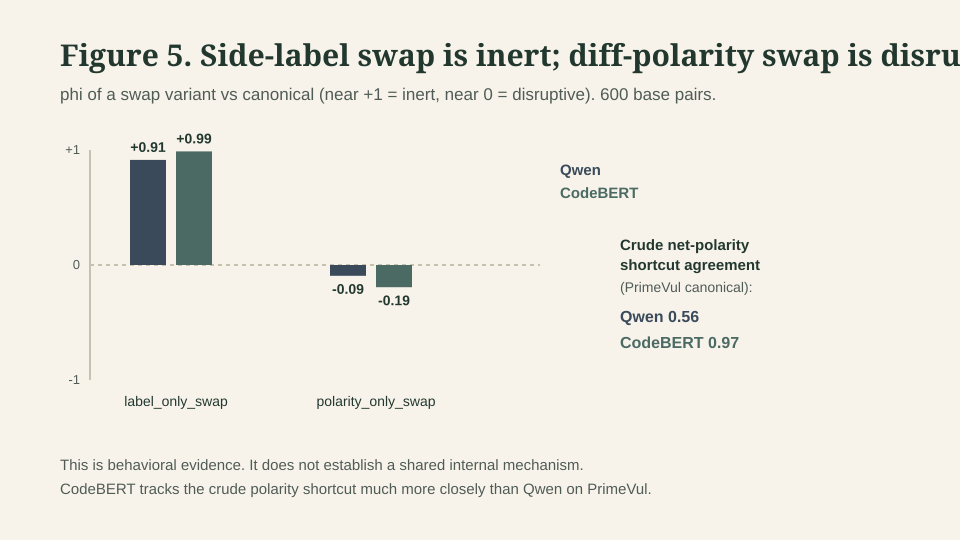
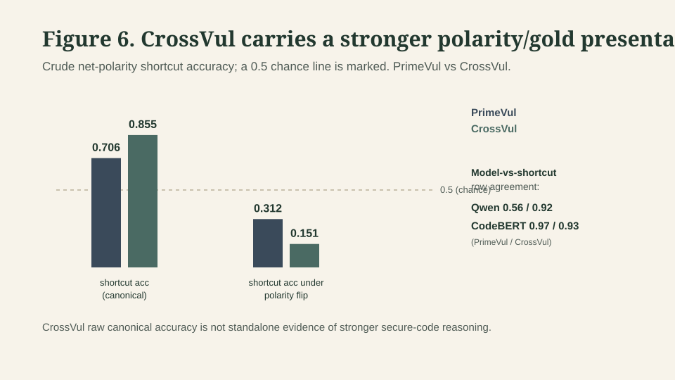
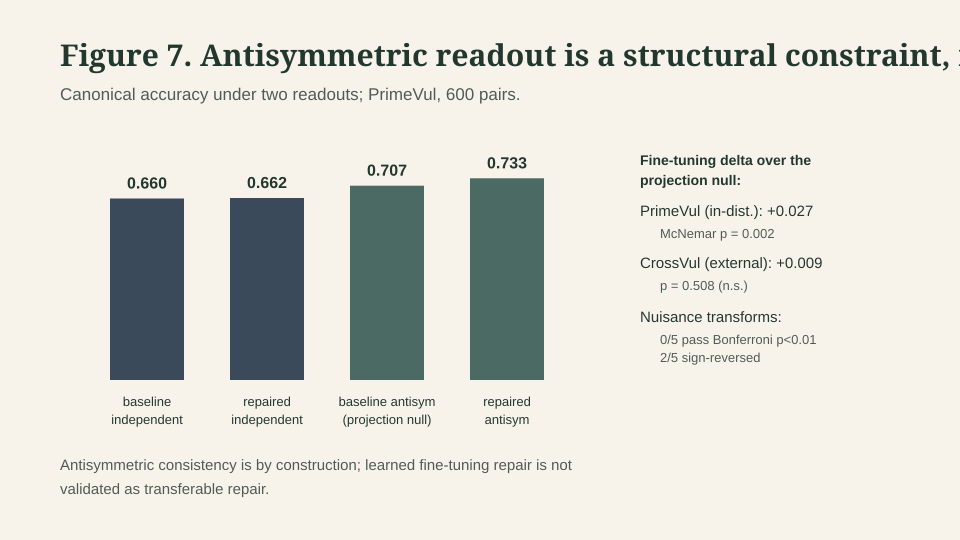

# Pointwise Accuracy Is Not Relational Consistency: Auditing Secure Patch Models Under Presentation-Structure Transformations

*Draft status: workshop short-paper draft (v1.1). Figures 1/5–7 and Tables 2/4
are embedded from `paper/figures/` and `paper/draft_v0.md`; no new experiments
or `[RESULT: ...]` anchors were introduced. Approximate body length is suitable
for a typical 4–8 page workshop body plus references, but page fit is not
validated against a venue template until SaTML 2027 (or the chosen venue)
publishes formatting requirements — see “Open Submission Requirements.”*

## Abstract (150-180 words)

Secure-code models are usually evaluated pointwise, but patch review is
relational: a model should identify which side of a vulnerable/fixed pair
is riskier — a candidate-identity judgment, not a directional “does this
patch fix or introduce” judgment. Pointwise secure-code accuracy can hide
relation-violating behavior induced by patch presentation structure. Under
a controlled decomposition, swapping the prose side labels leaves a
model’s decision nearly inert, while flipping diff-hunk polarity with the
gold answer held fixed collapses accuracy and moves the decision toward
independence. This ordering replicates across a Qwen decoder and a
competency-matched CodeBERT encoder, though the two differ in functional
form — a behavioral phenomenon, not a proven shared mechanism.

Raw canonical accuracy on CrossVul is inflated by a stronger version of
the same presentation shortcut. A hard antisymmetric readout is a
transferable structural consistency constraint; a learned fine-tuning
objective over it is not validated as transferable repair. This is a
measurement study, not a deployed vulnerability scanner, and it does not
replace human security review; secure-patch evaluation should report
relational consistency alongside pointwise accuracy.

## 1. Introduction

Security patch review is comparative: a reviewer asks which side of a
vulnerable/fixed pair carries the risk, and whether that answer would hold
if the two sides were presented in the opposite order. Most secure-code
evaluation reduces this to a pointwise question — is a single snippet
vulnerable? [RELATED: primevul; diversevul; codexglue] — which measures
detection accuracy but not whether a model represents the relation between
the two sides of a patch. This paper differs from prior vulnerability
benchmarks by treating vulnerable/fixed patch review as a *relational*
task rather than a pointwise label, and differs from generic behavioral and
counterfactual evaluation frameworks [RELATED: checklist; counterfactual-augmentation]
by attaching an expected relation to specific presentation-structure
transformations — side swaps, polarity flips — rather than testing
robustness in general. A model can look competent on individual examples
while behaving like two nearly independent classifiers once the sides of a
pair are swapped; that is not an ordinary classification error, it is a
failure of a structural property the task requires.

**Figure 1.** Pointwise accuracy can look strong while leaving the paired
vulnerable/fixed relation untested. VeriPatch-RR evaluates whether decisions
preserve known relations under side swaps and related presentation changes.
This motivates relational evaluation; it is not itself a vulnerability
detector.

This paper’s arc is **mechanism → polarity → confound → antisymmetric
repair**. Concretely, three tightly-scoped contributions: (i) a
candidate-identity task formulation for relation-preserving secure patch
evaluation; (ii) a controlled label-vs-polarity decomposition isolating
diff-hunk polarity, not prose side labels, as the driver of side-order
failure, replicated across a Qwen decoder [RELATED: qwen25-coder] and a
competency-matched CodeBERT encoder [RELATED: codebert]; and (iii) a
structural-vs-learned decomposition of an antisymmetric repair, with a
CrossVul confound check so raw cross-source accuracy is not misread as
reasoning. This is a measurement and mechanism study, not a new
vulnerability scanner — see `paper/draft_v0.md` for the full evidence base
and protocols this draft compresses. The framing is a trustworthy-ML evaluation
question: the evidence is behavioral and explicitly bounded rather than an
internal-mechanism proof; the repair evidence separates a structural guarantee
from an unvalidated learned objective; and the responsible-use limits in
Section 7 apply regardless of venue.

## 2. Task Formulation

We consider a paired patch input `x = (A, B)`, two rendered sides of a
vulnerable/fixed pair, with gold label `y ∈ {A, B}` identifying the riskier
side. Our task is a *candidate-identity* judgment — which of two related
code states is riskier — not a *directional-patch* judgment of whether a
given patch fixes or introduces a vulnerability. The distinction governs
how diff-hunk polarity should be treated: under the directional-patch
framing, polarity (which code sits on removed vs. added lines) is semantic
content a model should use; under candidate-identity, Side A and Side B
denote fixed code regardless of how their difference is rendered, so
polarity is a *nuisance variable* a robust model’s decision should not
depend on.

Concretely: consider a buffer-overflow-vulnerable function (Side A) and its
patched counterpart (Side B). The candidate-identity question is simply
which of the two states is riskier, independent of whether the pair is
rendered as a forward diff (vulnerable to fixed) or a reverse diff (fixed
to vulnerable) — this is different from a directional-patch question such
as “does this specific patch fix or introduce a vulnerability,” where the
diff’s direction is itself the content being judged. Diff polarity is
therefore semantic content under the directional-patch framing but a
nuisance variable under candidate-identity.

We treat polarity as nuisance because Side A/Side B assignment is
independent of which side is vulnerable in our benchmark, so rendering
orientation carries no information about gold [RESULT: polarity-gold-confound].
A side-order consistent model’s answer should flip under an exact side
swap; measuring whether it does — against a marginal-conditioned
independence baseline rather than a naive chance line — is the evaluation
threat this paper studies.

## 3. VeriPatch-RR Evaluation Design

VeriPatch-RR is a paired vulnerable/fixed patch benchmark built from
PrimeVul [RELATED: primevul], DeltaSecommits [RELATED: deltasecommits], and
PatchEval [RELATED: patcheval], materialized per model tokenizer so
truncation and evidence visibility are part of the experimental record
rather than a post hoc explanation. It separates ordinary accuracy from
side-order equivariance, both-directions-correct behavior, and endpoint
robustness, treating each transformation as a relation test only when its
expected relation is specified before evaluation. A same-source PrimeVul
detector reaches `0.9524` accuracy, but paired negative controls
(metadata-only `0.5022`, candidate-only `0.5078`, counterpart-only `0.5156`
balanced accuracy) stay near chance [RESULT: primevul-progressive-controls]
— protecting the claim that the paired task carries real relational signal
rather than only dataset artifacts.

## 4. Label-vs-Polarity Findings

The side-swap transformation moves two factors at once: the prose side
labels and the diff-hunk polarity. Decomposing them on the Qwen classifier,
holding everything else fixed, isolates the driver of side-order failure.

**Figure 5.** Swapping the prose “Side A”/“Side B” labels leaves predictions
near phi `+1` (inert) for both Qwen and CodeBERT, while flipping diff-hunk
polarity moves phi near `0` (disruptive). The side panel shows per-row
agreement with a crude net-polarity shortcut on PrimeVul. Behavioral
evidence only — not a shared internal mechanism. CodeBERT tracks that
shortcut much more closely than Qwen.

**Table 2. Label-vs-polarity mechanism decomposition (600 base pairs).**
phi is the coefficient of a variant’s predictions against canonical; high
positive phi means the swap is inert; phi near zero means the swap moved
the prediction. Crude-shortcut agreement is per-row agreement with a
net-polarity line-count heuristic on PrimeVul.

| Metric | Qwen | CodeBERT |
| --- | ---: | ---: |
| canonical accuracy | 0.660 | 0.677 |
| label_only_swap phi (vs canonical) | +0.914 | +0.988 |
| polarity_only_swap phi (vs canonical) | −0.094 | −0.193 |
| polarity_only accuracy (gold fixed) | 0.345 | 0.352 |
| crude net-polarity shortcut agreement (PrimeVul) | ~0.57 | ~0.96 |

Sources: [RESULT: qwen-label-only-swap], [RESULT: qwen-polarity-only-swap],
[RESULT: codebert-label-polarity-replication]. Swapping only the prose
labels leaves the prediction almost unchanged; flipping only polarity, with
labels and gold held fixed, moves the prediction to near-independence and
collapses accuracy even though gold is unchanged. This pattern is not generic prompt sensitivity: if arbitrary wording changes destabilized the
prediction, both interventions would be equally disruptive, but the
label-only swap is nearly inert while the polarity-only swap is not — the
evidence points to diff-hunk presentation structure specifically. The
ordering replicates on the competency-matched CodeBERT encoder. **The
functional form differs** — CodeBERT tracks a crude net-polarity shortcut
on PrimeVul far more closely than Qwen does — so the evidence supports a
cross-architecture *behavioral* ordering, not a shared internal mechanism.

## 5. Cross-Source and Cross-Architecture Checks

We measure the same net-polarity/gold structure on CrossVul
[RELATED: crossvul], an external source, and find it carries a *stronger*
presentation shortcut than PrimeVul [RESULT: crossvul-polarity-gold-confound].

**Figure 6.** The crude net-polarity shortcut predicts gold better on
CrossVul than PrimeVul at canonical rendering, and inverts further below
chance under a gold-fixed polarity flip; both models’ per-row agreement
with the shortcut is high on CrossVul. CrossVul raw canonical accuracy is
not standalone evidence of stronger secure-code reasoning.

| Metric | PrimeVul | CrossVul |
| --- | ---: | ---: |
| Crude net-polarity shortcut canonical accuracy | `0.706` | `0.855` |
| Qwen row agreement with shortcut | `~0.57` | `~0.92` |
| CodeBERT row agreement with shortcut | `~0.96` | `~0.93` |

*(Same evidence already cited above and in Section 4 — this table
re-presents it compactly and is not a new result. Full four-row confound
breakdown is in the full draft / supplement.)*

CrossVul’s higher canonical accuracy should therefore not be read as
stronger secure-code reasoning; it coincides with a stronger measured
presentation shortcut both architectures lean on more heavily than either
does on PrimeVul. That Qwen does *not* reduce to the shortcut on PrimeVul
(`~0.57`) is itself evidence against reading either source’s raw accuracy
as a standalone reasoning signal. Broader low-canonical stress replications
(non-Qwen decoder and generative-judge slots in the full paper) extend
mechanism coverage without supporting a universal failure claim.

## 6. Repair Decomposition

Having isolated a presentation-structure failure rather than a
prompt-wording artifact, we next ask whether side-order consistency can be
enforced structurally or must instead be learned.

**Figure 7.** Canonical accuracy under the independent per-rendering readout
and the antisymmetric projection-null readout, for baseline and repaired
models; the side panel gives the fine-tuning delta over the null on
PrimeVul (in distribution), CrossVul (external), and nuisance transforms.
Antisymmetric consistency is by construction; learned fine-tuning repair is
not validated as transferable repair.

**Table 4. Repair decomposition (canonical accuracy).** “Independent” is the
per-rendering readout; “antisymmetric inference” is the projection-null
readout whose side-swap invariance is exact by construction. The fine-tuning
delta is the repaired-minus-baseline gap under antisymmetric inference.

| Condition | PrimeVul |
| --- | ---: |
| baseline, independent inference | 0.660 |
| repaired, independent inference | 0.662 |
| baseline, antisymmetric inference (projection null) | 0.707 |
| repaired, antisymmetric inference | 0.733 |
| fine-tuning delta over null (PrimeVul, in-distribution) | +0.027 (McNemar p=0.002) |
| fine-tuning delta over null (CrossVul, external source) | +0.009 (p=0.508, n.s.) |
| fine-tuning delta over null (5 nuisance families) | 0/5 pass Bonferroni p<0.01; 2/5 sign-reversed |

Sources: [RESULT: antisymmetric-repair]. We separate two claims that are
easy to conflate. A hard antisymmetric readout — a pairwise scorer with
`s(A, B) = -s(B, A)` by construction — makes side-swap equivariance exact
and polarity-invariance structural rather than learned. Evaluated on the
held-out polarity audit, on CrossVul, and on five held-out nuisance-transform
families, this structural constraint holds and preserves canonical accuracy.
The *learned* part is different: a fine-tuning objective layered over the
antisymmetric readout showed a canonical-accuracy increment that was
significant in-distribution (McNemar `p = 0.002`) but did not survive
transfer — not significant on CrossVul (`p = 0.508`), and clearing no family
at a Bonferroni-corrected threshold across the five nuisance transforms, with
two families reversing sign. The antisymmetric readout is retained as a
transferable structural consistency constraint; the learned fine-tuning
objective is left unresolved.

## 7. Limitations and Responsible Use

This is a measurement and mechanism study, not a deployed vulnerability
scanner, and it does not replace human security review; a confident wrong
answer is more dangerous in security review than an abstention, so false
reassurance from an unvalidated system is a real risk this study does not
resolve. The task studied is candidate-identity — which of two related
code states is riskier — not a directional judgment of whether a patch
fixes or introduces a vulnerability, and the findings should not be read
past that boundary. Evidence localization and abstention are the
mechanisms a real deployment would need and are evaluated here only as
diagnostics [RELATED: eraser; attention-not-explanation]; any
deployment-facing use of this evaluation approach requires additional
validation beyond what is reported here. The mechanism evidence is
behavioral — controlled input interventions on model outputs — not an
internal-mechanistic proof; the label-vs-polarity ordering replicates
across two architecture families, which is broader than one model but is
not a universality claim, and the Qwen/CodeBERT functional-form divergence
(Section 4) further bounds any shared-mechanism reading.

## 8. Reproducibility and Artifacts

Every numeric claim above is tied to a `[RESULT: ...]` anchor resolved by
`paper/result_anchor_map.md` to a retained report under `reports/` plus
supporting JSON; runnable SHA256 manifests live under `reproducibility/`.
Mechanism, confound, and repair tables recompute from committed prediction
artifacts via pure-counting scripts — no model inference is required to
rebuild those tables once release artifacts are present.

**What CI smoke verifies.** Fresh-clone CI checks the external adapter on a
checked-in 30-pair smoke artifact, paper scaffold integrity (anchors map to
existing reports), results-index rendering, and a
`reproducibility/veripatch_external_smoke_manifest.json` `--check-only`
pass. CI does **not** train models, run GPU inference, or treat the 30-pair
smoke set as a quality benchmark (`docs/CI_TESTING_STRATEGY.md`).

**What needs release bundles.** Full VeriPatch-RR claims, tokenizer-specific
runtime materialization, and large prediction dumps are release-bundle or
local-research artifacts — not implied by a green CI run. Public release
should ship the manifests and hashes that pin those artifacts; until then,
this short paper should be read as measurement evidence backed by the
committed reports it cites, not as a claim that every pipeline stage is
reproducible from the public clone alone.

## Supplement Note

The following move out of the body into supplementary material / the full
draft:

- Full related-work positioning — the body keeps the distinguishing
  sentence in Section 1.
- Full benchmark-diagnosis detail behind Section 3’s motivating sentence.
- The full four-row Table 3 CrossVul confound breakdown (body keeps the
  reduced contrast table and Figure 6).
- Full nuisance-transform repair detail behind Section 6’s “0/5 families,
  2 sign-reversed” headline.
- Readout/endpoint-robustness mechanism thread (full draft §7) — out of
  scope for this short paper’s arc.
- Full appendices and reproduction protocols.

## Claim Boundaries

This draft does not claim: that secure patch reasoning has been solved;
that this is a deployed vulnerability scanner; a universal failure claim
covering all models; proof of an internal mechanism; a learned repair
claimed as validated or transferable; that this is a production-ready
security tool; or that the system replaces human review or a human
reviewer.

## Open Submission Requirements

SaTML 2027’s full submission requirements — page limit, anonymity policy,
preprint/dual-submission policy, and AI-use disclosure formatting — are
not yet published and must be re-checked against
`https://satml.org/call-for-papers/` before final page-limit decisions,
anonymity decisions, preprint timing, and AI-use disclosure formatting are
locked in. This draft plans against a typical NeurIPS/USENIX-style workshop
body of roughly 4–8 pages plus references (and SaTML 2026’s historical
5–12pp precedent as a loose upper bound), not a confirmed 2027 requirement.
Approximate body word count with embedded figures/tables is still expected
to fit that band in single-column draft rendering; final page fit requires
a venue-template PDF build.
