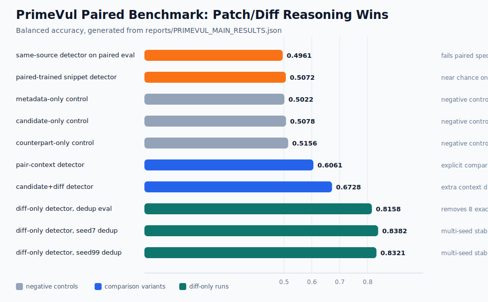

# PrimeVul Main Results

This table is generated from run artifacts by `scripts/build_primevul_main_results.py`.

## Summary

- Headline: PrimeVul paired diff reasoning is the strongest current formulation.
- Diff-only dedup multi-seed balanced accuracy mean: `0.8287`
- Diff-only dedup multi-seed range: `0.8158-0.8382`
- Strongest negative-control balanced accuracy: `0.5156`

## Main Table

| System | Threshold | Accuracy | Recall | Specificity | Precision | F1 | Balanced Accuracy | Note |
| --- | ---: | ---: | ---: | ---: | ---: | ---: | ---: | --- |
| same-source detector | 0.5000 | 0.9524 | 0.9709 | 0.9339 | 0.9363 | 0.9533 | 0.9524 | artifact-sensitive same-source holdout |
| same-source detector on paired eval | 0.9999 | 0.4961 | 0.1922 | 0.8000 | 0.4901 | 0.2761 | 0.4961 | fails paired specificity |
| paired-trained snippet detector | 0.6000 | 0.5072 | 0.3989 | 0.6156 | 0.5092 | 0.4474 | 0.5072 | near chance on paired snippets |
| metadata-only control | 0.5000 | 0.5022 | 0.6644 | 0.3400 | 0.5017 | 0.5717 | 0.5022 | negative control |
| candidate-only control | 0.2000 | 0.5078 | 0.8989 | 0.1167 | 0.5044 | 0.6462 | 0.5078 | negative control |
| counterpart-only control | 0.7000 | 0.5156 | 0.2011 | 0.8300 | 0.5419 | 0.2934 | 0.5156 | negative control |
| pair-context detector | 0.4000 | 0.6061 | 0.6589 | 0.5533 | 0.5960 | 0.6259 | 0.6061 | explicit comparison helps |
| candidate+diff detector | 0.5000 | 0.6728 | 0.7178 | 0.6278 | 0.6585 | 0.6869 | 0.6728 | extra context dilutes patch signal |
| diff-only detector | 0.6000 | 0.8156 | 0.8022 | 0.8289 | 0.8242 | 0.8131 | 0.8156 | best original paired formulation |
| diff-only detector, dedup eval | 0.6000 | 0.8158 | 0.8022 | 0.8294 | 0.8243 | 0.8131 | 0.8158 | removes 8 exact/near-duplicate eval rows |
| diff-only detector, seed7 dedup | 0.5000 | 0.8382 | 0.8291 | 0.8473 | 0.8441 | 0.8365 | 0.8382 | multi-seed stability |
| diff-only detector, seed99 dedup | 0.5000 | 0.8320 | 0.8503 | 0.8138 | 0.8200 | 0.8349 | 0.8321 | multi-seed stability |
