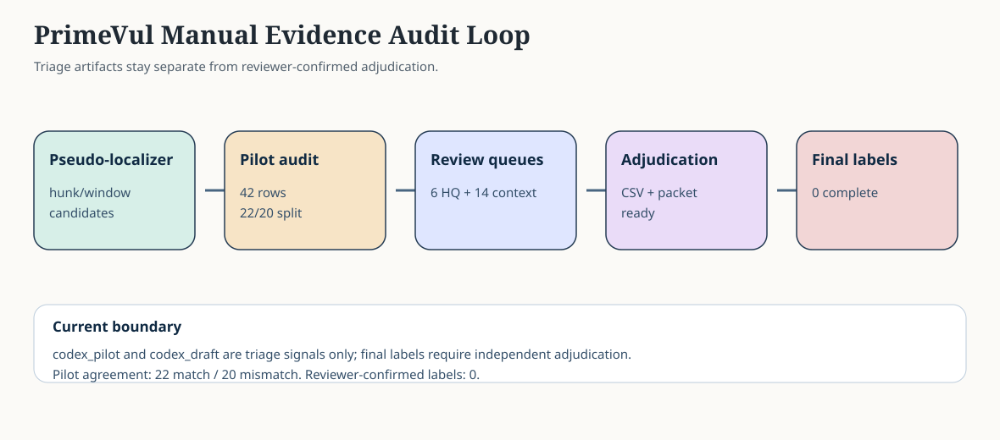

# PrimeVul Manual Evidence Audit Loop

This one-page summary shows how the evidence line moves from pseudo-localization to reviewer-confirmed labels.

## Loop Snapshot

- Pilot audit rows: `42`
- Pilot/gold agreement: `22` match / `20` mismatch
- Agreement rate: `0.5238`
- High-quality disagreement queue: `6` rows
- Insufficient-context queue: `14` rows
- Non-final `codex_draft` suggestions: `6` rows
- Completed independent adjudications: `0`

## Stage Table

| Stage | Artifact | Current Status |
| --- | --- | --- |
| Pseudo-localization | Hunk/window evidence candidates | Diagnostic only |
| Pilot review | `codex_pilot` annotations | Complete over `42/42`; not human gold |
| Queue construction | High-quality disagreement and insufficient-context JSONL | `6 + 14` rows materialized |
| Reviewer workflow | CSV template plus focused packet | Ready for independent adjudication |
| Draft suggestions | `codex_draft` suggestions | `6` non-final triage hints |
| Final labels | Adjudicated queue JSONL | `0` completed so far |

## Key Boundary

`codex_pilot` and `codex_draft` are triage artifacts. The first reviewer-confirmed artifact begins only after the adjudication CSV is filled and applied.

## Links

- [Pilot Findings](PRIMEVUL_MANUAL_EVIDENCE_PILOT_FINDINGS.md)
- [Review Queues](PRIMEVUL_MANUAL_EVIDENCE_REVIEW_QUEUES.md)
- [Adjudication Workflow](PRIMEVUL_MANUAL_EVIDENCE_ADJUDICATION_WORKFLOW.md)
- [High Quality Packet](PRIMEVUL_MANUAL_EVIDENCE_HIGH_QUALITY_ADJUDICATION_PACKET.md)
- [Draft Adjudications](PRIMEVUL_MANUAL_EVIDENCE_HIGH_QUALITY_DRAFT_ADJUDICATIONS.md)
