# Secure Code Visual Diagnostics

This report turns the current `PrimeVul` secure-code diagnostics into lightweight, dependency-free Mermaid charts.

It is designed to answer two questions quickly:

- where does `SFT` actually improve over `Base`?
- how do error shape and calibration change when we move from `eval244` to `holdout1000`?

## Benchmark-level Metric Comparison

### eval244

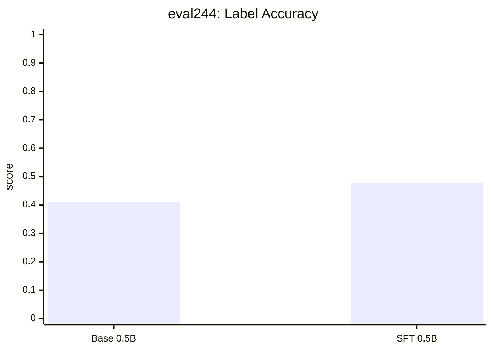
```mermaid
xychart-beta
    title "eval244: Label Accuracy"
    x-axis ["Base 0.5B", "SFT 0.5B"]
    y-axis "score" 0 --> 1
    bar [0.4098, 0.4795]
```

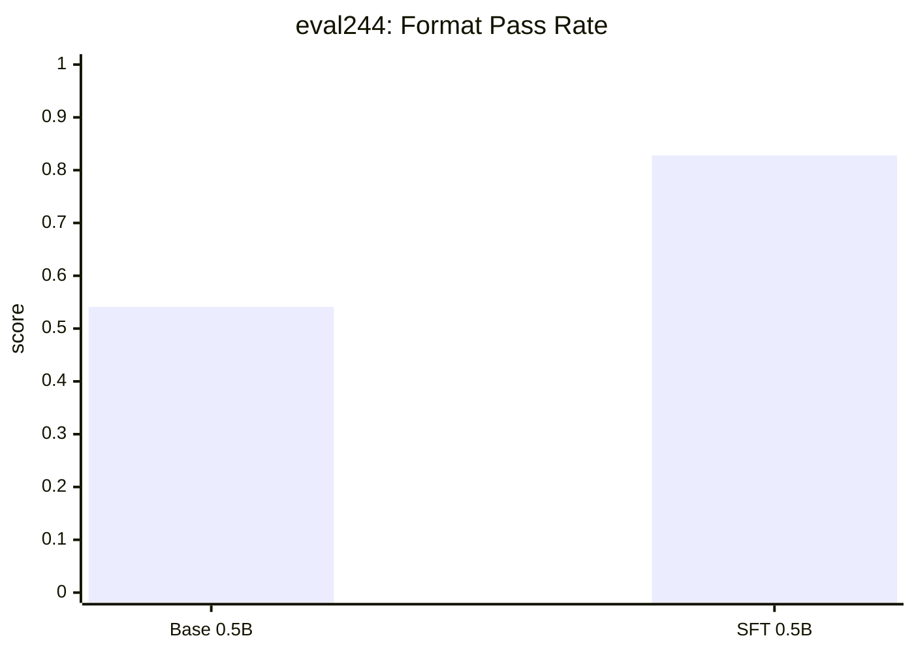
```mermaid
xychart-beta
    title "eval244: Format Pass Rate"
    x-axis ["Base 0.5B", "SFT 0.5B"]
    y-axis "score" 0 --> 1
    bar [0.5410, 0.8279]
```

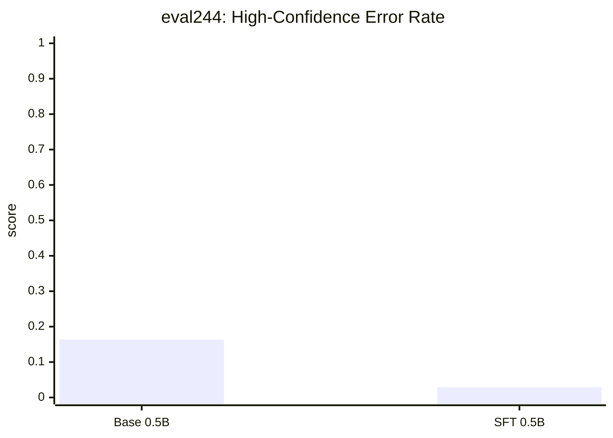
```mermaid
xychart-beta
    title "eval244: High-Confidence Error Rate"
    x-axis ["Base 0.5B", "SFT 0.5B"]
    y-axis "score" 0 --> 1
    bar [0.1639, 0.0287]
```

### holdout1000

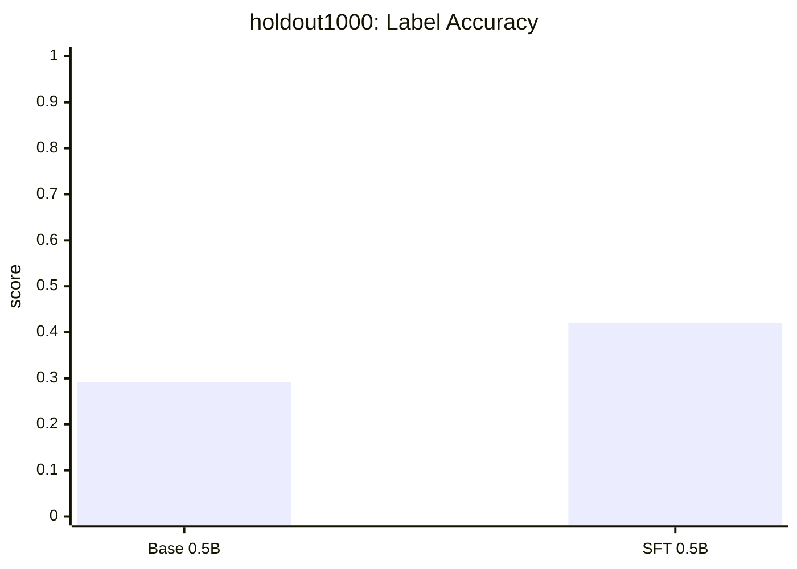
```mermaid
xychart-beta
    title "holdout1000: Label Accuracy"
    x-axis ["Base 0.5B", "SFT 0.5B"]
    y-axis "score" 0 --> 1
    bar [0.2920, 0.4200]
```

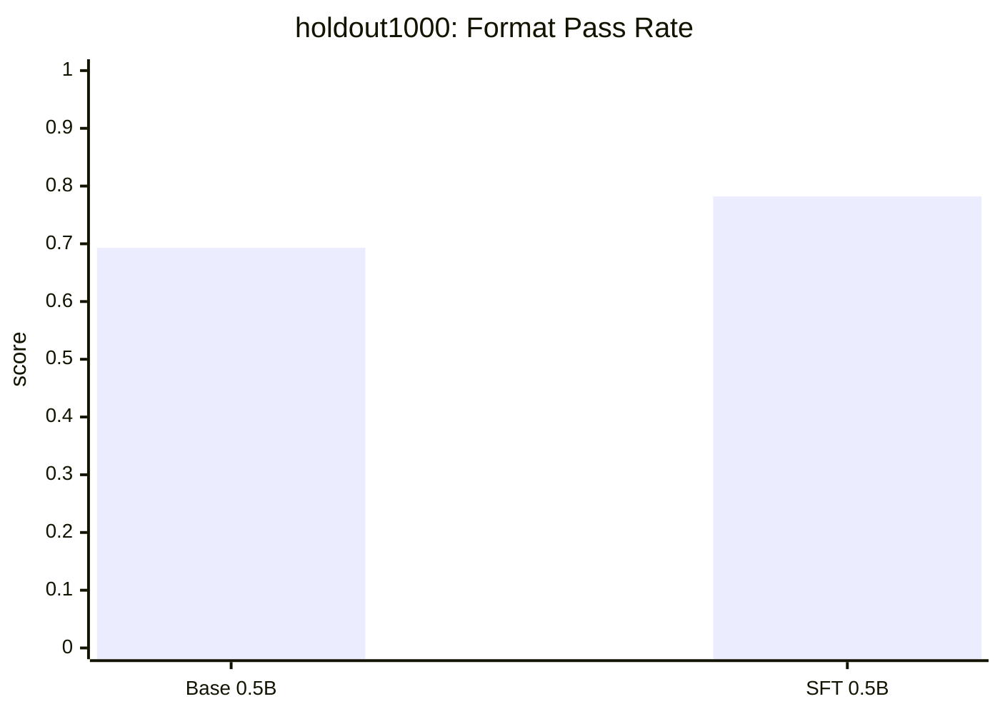
```mermaid
xychart-beta
    title "holdout1000: Format Pass Rate"
    x-axis ["Base 0.5B", "SFT 0.5B"]
    y-axis "score" 0 --> 1
    bar [0.6930, 0.7820]
```

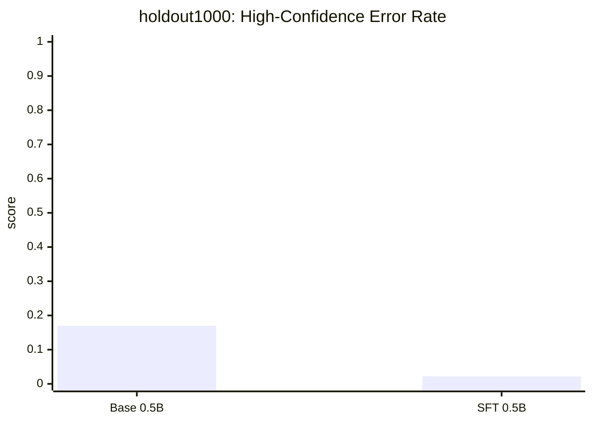
```mermaid
xychart-beta
    title "holdout1000: High-Confidence Error Rate"
    x-axis ["Base 0.5B", "SFT 0.5B"]
    y-axis "score" 0 --> 1
    bar [0.1700, 0.0220]
```

## Failure Taxonomy Visuals

### eval244

#### Base 0.5B

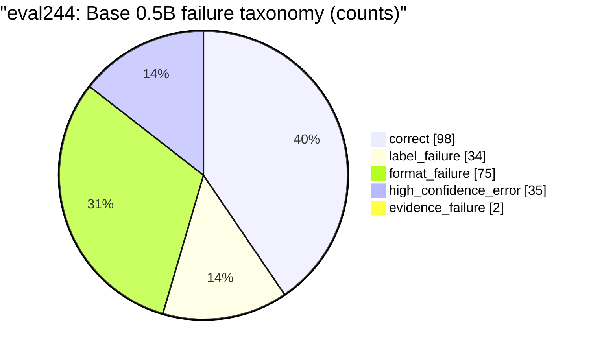
```mermaid
pie showData
    title "eval244: Base 0.5B failure taxonomy (counts)"
    "correct" : 98
    "label_failure" : 34
    "format_failure" : 75
    "high_confidence_error" : 35
    "evidence_failure" : 2
```

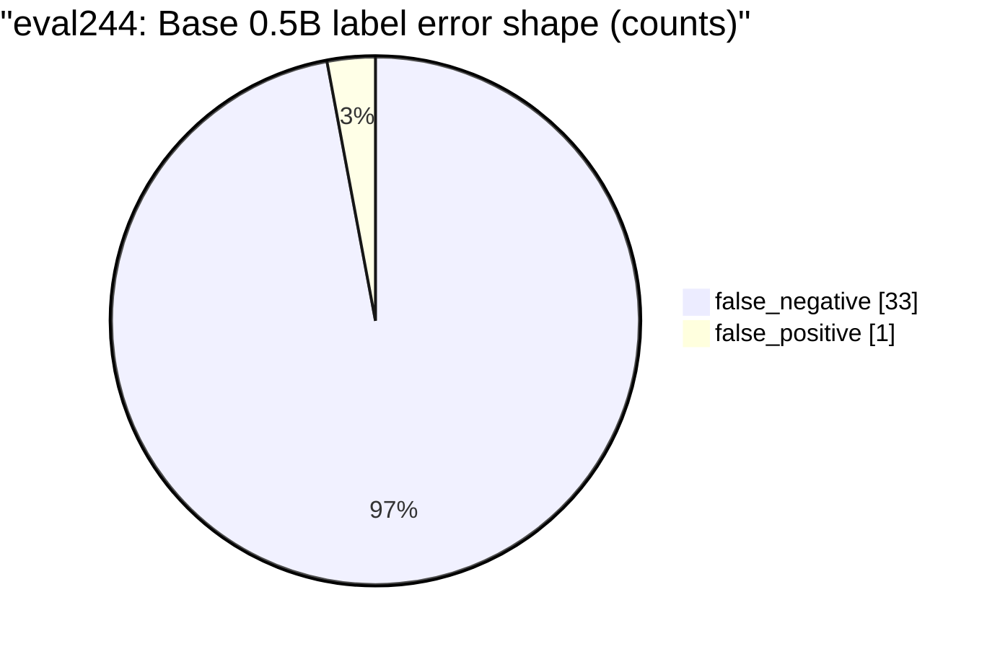
```mermaid
pie showData
    title "eval244: Base 0.5B label error shape (counts)"
    "false_negative" : 33
    "false_positive" : 1
```

Top format failure triggers:

| Format trigger | Count |
| --- | ---: |
| hard_fail | 75 |

#### SFT 0.5B

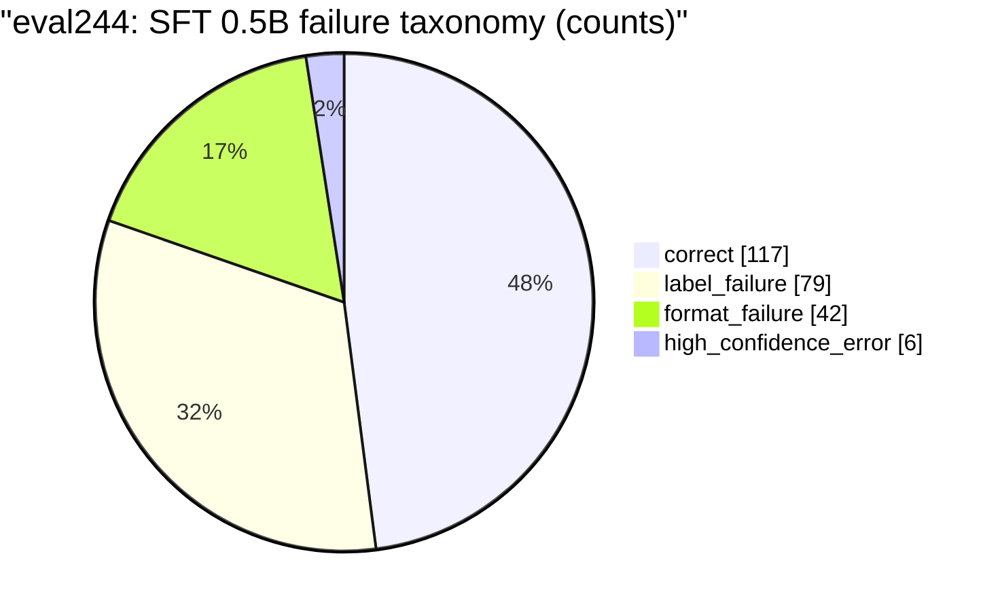
```mermaid
pie showData
    title "eval244: SFT 0.5B failure taxonomy (counts)"
    "correct" : 117
    "label_failure" : 79
    "format_failure" : 42
    "high_confidence_error" : 6
```

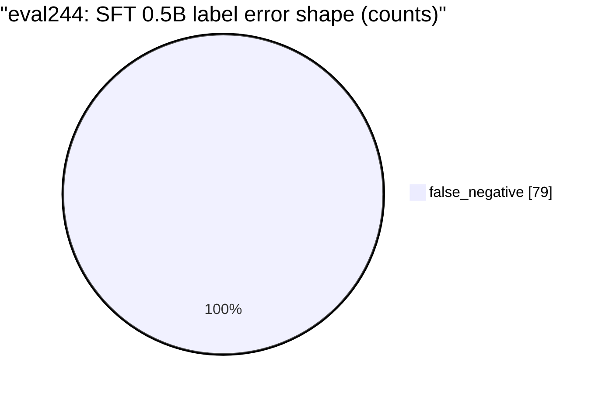
```mermaid
pie showData
    title "eval244: SFT 0.5B label error shape (counts)"
    "false_negative" : 79
```

Top format failure triggers:

| Format trigger | Count |
| --- | ---: |
| hard_fail | 42 |

### holdout1000

#### Base 0.5B

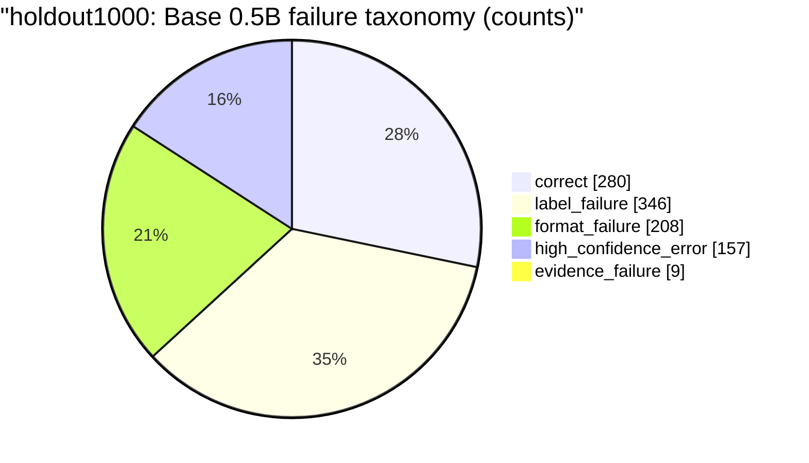
```mermaid
pie showData
    title "holdout1000: Base 0.5B failure taxonomy (counts)"
    "correct" : 280
    "label_failure" : 346
    "format_failure" : 208
    "high_confidence_error" : 157
    "evidence_failure" : 9
```

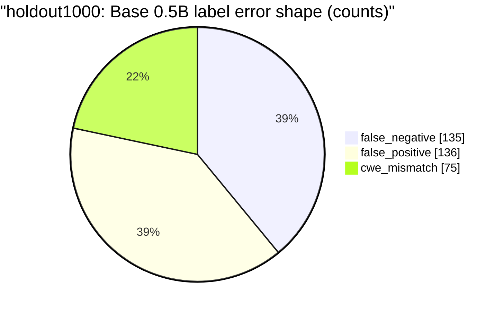
```mermaid
pie showData
    title "holdout1000: Base 0.5B label error shape (counts)"
    "false_negative" : 135
    "false_positive" : 136
    "cwe_mismatch" : 75
```

Top format failure triggers:

| Format trigger | Count |
| --- | ---: |
| hard_fail | 208 |

#### SFT 0.5B

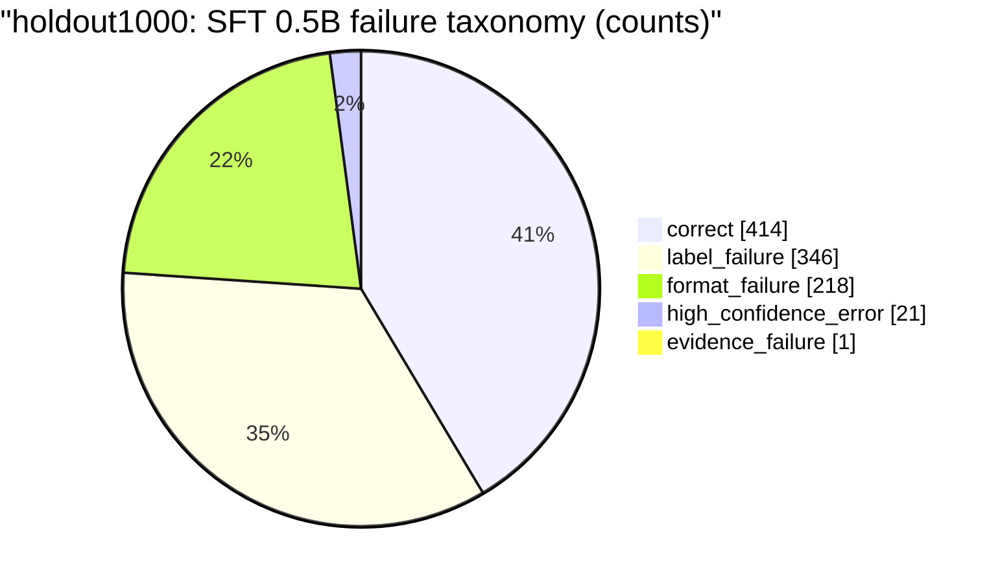
```mermaid
pie showData
    title "holdout1000: SFT 0.5B failure taxonomy (counts)"
    "correct" : 414
    "label_failure" : 346
    "format_failure" : 218
    "high_confidence_error" : 21
    "evidence_failure" : 1
```

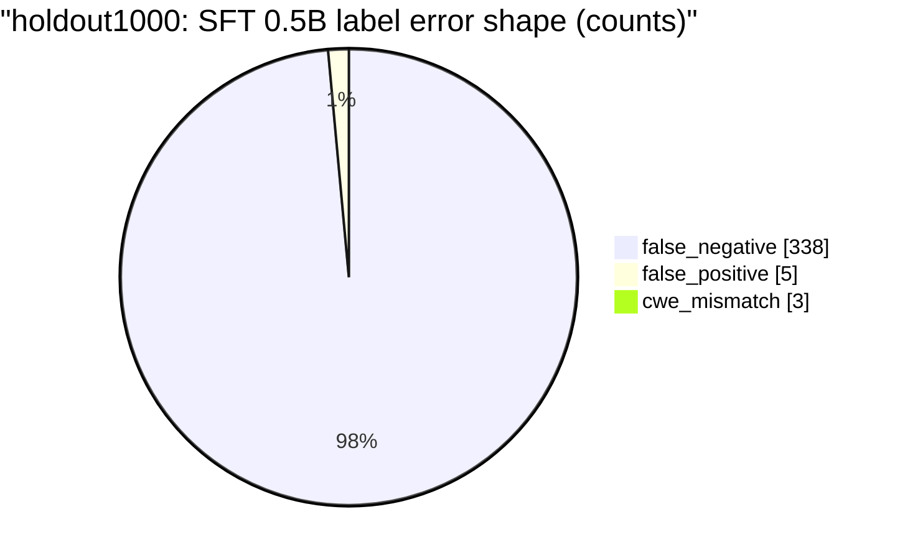
```mermaid
pie showData
    title "holdout1000: SFT 0.5B label error shape (counts)"
    "false_negative" : 338
    "false_positive" : 5
    "cwe_mismatch" : 3
```

Top format failure triggers:

| Format trigger | Count |
| --- | ---: |
| hard_fail | 218 |

## Calibration Visuals

### eval244

#### Base 0.5B

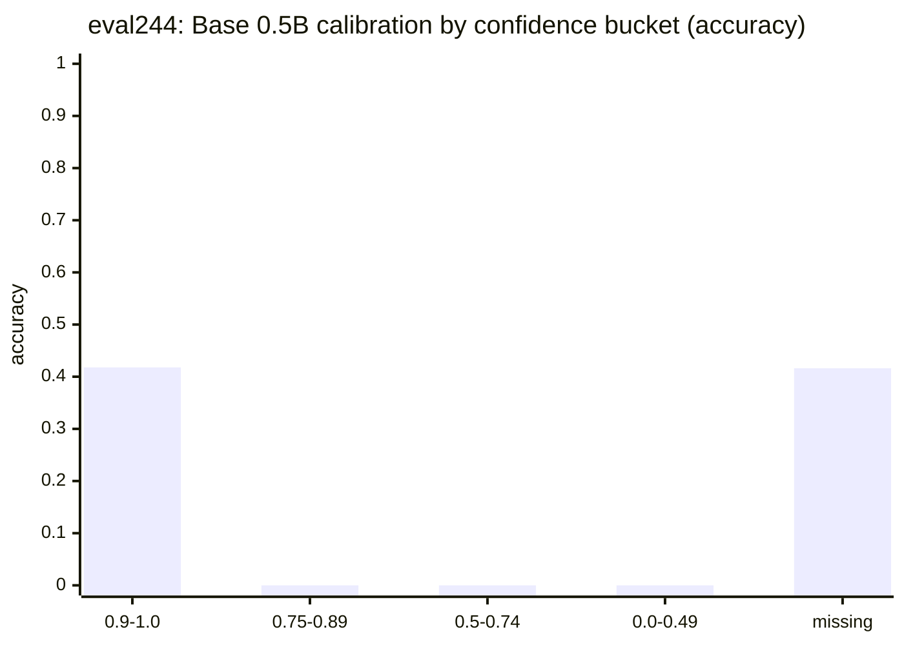
```mermaid
xychart-beta
    title "eval244: Base 0.5B calibration by confidence bucket (accuracy)"
    x-axis ["0.9-1.0", "0.75-0.89", "0.5-0.74", "0.0-0.49", "missing"]
    y-axis "accuracy" 0 --> 1
    bar [0.4179, 0.0000, 0.0000, 0.0000, 0.4162]
```

#### SFT 0.5B

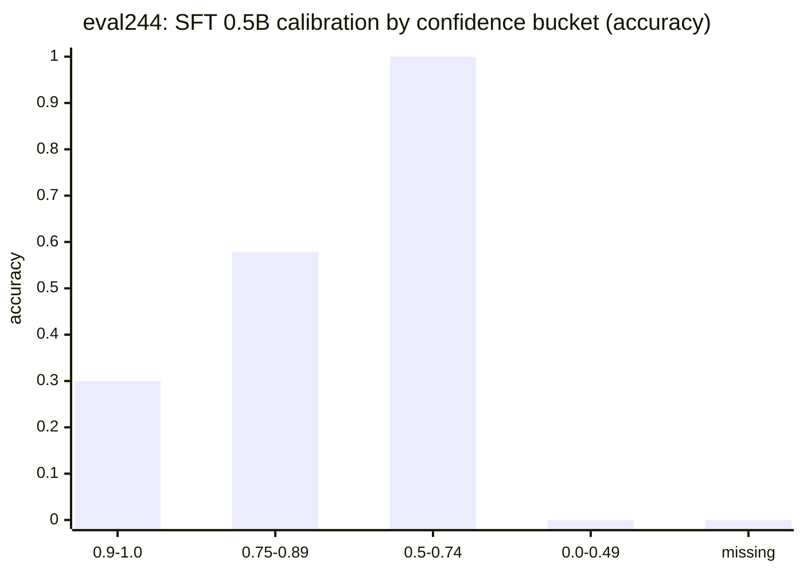
```mermaid
xychart-beta
    title "eval244: SFT 0.5B calibration by confidence bucket (accuracy)"
    x-axis ["0.9-1.0", "0.75-0.89", "0.5-0.74", "0.0-0.49", "missing"]
    y-axis "accuracy" 0 --> 1
    bar [0.3000, 0.5781, 1.0000, 0.0000, 0.0000]
```

### holdout1000

#### Base 0.5B

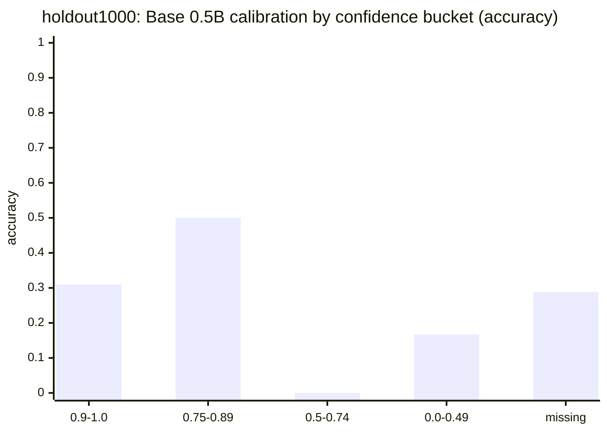
```mermaid
xychart-beta
    title "holdout1000: Base 0.5B calibration by confidence bucket (accuracy)"
    x-axis ["0.9-1.0", "0.75-0.89", "0.5-0.74", "0.0-0.49", "missing"]
    y-axis "accuracy" 0 --> 1
    bar [0.3099, 0.5000, 0.0000, 0.1667, 0.2885]
```

#### SFT 0.5B

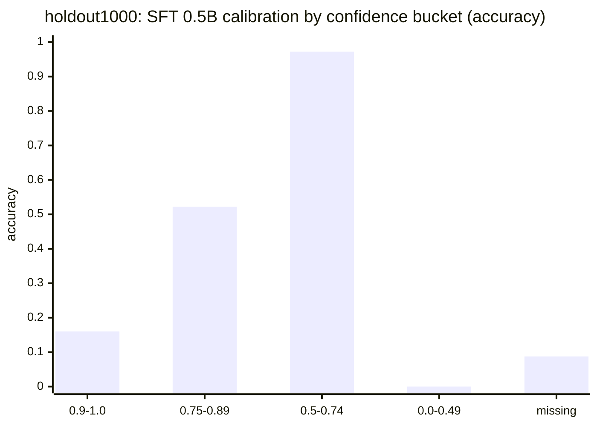
```mermaid
xychart-beta
    title "holdout1000: SFT 0.5B calibration by confidence bucket (accuracy)"
    x-axis ["0.9-1.0", "0.75-0.89", "0.5-0.74", "0.0-0.49", "missing"]
    y-axis "accuracy" 0 --> 1
    bar [0.1600, 0.5218, 0.9722, 0.0000, 0.0876]
```

## Visual Readout

- `SFT 0.5B` improves label accuracy on both benchmarks, but the bigger story is calibration: it removes most of the damaging high-confidence errors.
- `holdout1000` is visibly harder than `eval244`, so the charts on the larger benchmark should be treated as the stronger estimate of real secure-code performance.
- The remaining semantic error shape of the best model is still dominated by `false_negative`, which points future work toward recall and vulnerability coverage rather than more aggressive anti-overdetection tuning.
